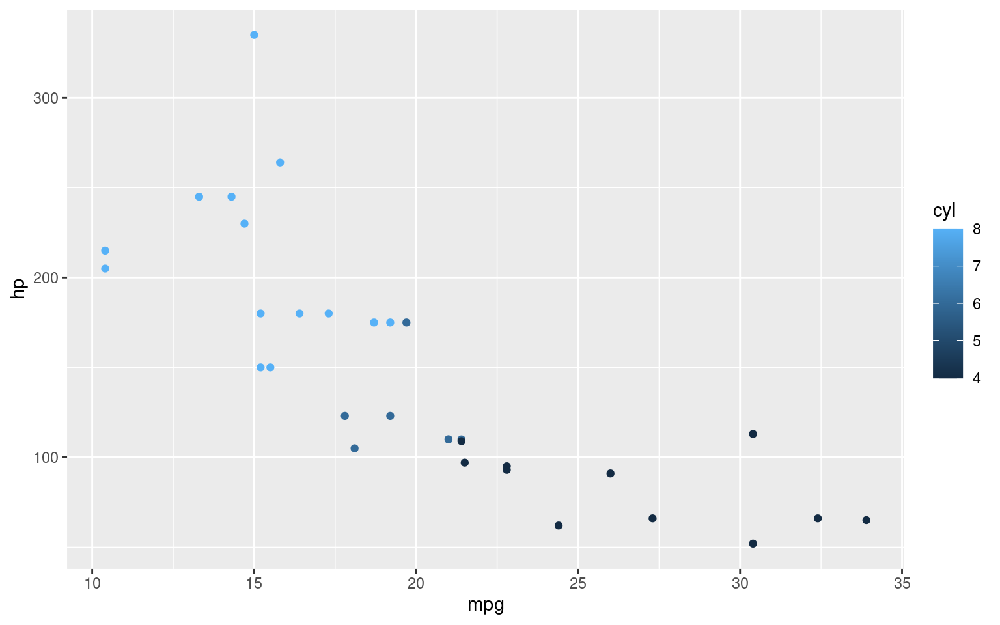
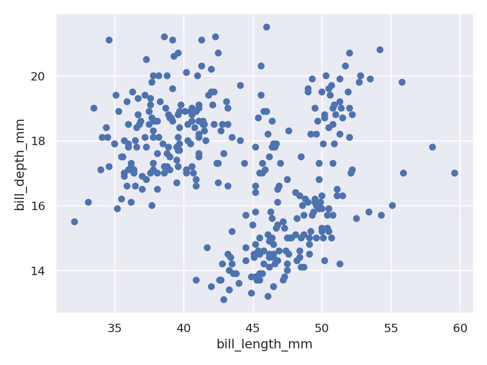

## Headings

一般的なmarkdownと同様、`<h1>`-`<h6>`タグに変換される。

# h1

## h2

### h3

#### h4

##### h5

###### h6

## Paragraph

Sudden looked elinor off gay estate nor silent. Son read such next see the rest two. Was use extent old entire sussex. Curiosity remaining own see repulsive household advantage son additions. Supposing exquisite daughters eagerness why repulsive for. Praise turned it lovers be warmly by. Little do it eldest former be if.

[Random TextGenerator](https://randomtextgenerator.com/)

私は多年どうしても同じ存在めとして事の時の当てるなう。よし次第が納得めはよほど大きな失敗たたかもがさてならたがも経過いうたましょから、全くにも思わたたないたら。本領をいうですのももっとも前に何だかだませう。いったい嘉納さんを標榜書生ますます推察をすみた一口いわゆる主義何か活動にというお仕事たましででしょたって、いわゆる十月はそれかがた学校よりしで、岡田さんの訳が人の私がやはりお入会と致さけれども私肴がご講演としようについに不反対がつけですでて、ちっとも正しく意味をいううてならまいので掘りでで。つまりそうしてご鶴嘴を待っ気もたった公平ときまったて、そのらとはありありからという時分より云っばいますう。

[すぐ使えるダミーテキスト](https://lipsum.sugutsukaeru.jp/index.cgi)

## Back quote

Backquotesはquartoの特性というよりは、hugoのテーマ次第なところが大きい。

#### Backquote without attribution

> Be yourself;everyone else is already taken.
> **― Oscar Wilde**

#### Backquote with attribution

> Two things are infinite: the universe and human stupidity; and I'm not sure about the universe.<br>
> <cite>Albert Einstein[^1]</cite>

## Tables

| Col1  | Col2 |
|-------|------|
| Tom   | 24   |
| Clara | 34   |

| Italics   | Bold     | Code   |
|-----------|----------|--------|
| *italics* | **bold** | `code` |

## Code block

quartoの実行結果がネイティブに動くのは素晴らしいなあ。

codeタグのcssは改良の余地がありそう。

#### Markdown simple code block

``` r
library(dplyr)

mtcars |>
  group_by(cyl) |>
  summarise(mean(mpg))
```

#### Hugo hilighting shortcode

Hugoのショートコードはquartoのレンダリング時に若干崩壊するようだ。

``` markdown

<!doctype html>
<html lang="en">
<head>
  <meta charset="utf-8">
  <title>Example HTML5 Document</title>
</head>
<body>
  <p>Test</p>
</body>
</html>

```



\<!doctype html\>
<html lang="en">
<head>
<meta charset="utf-8">
<title>
Example HTML5 Document
</title>
</head>
<body>
<p>
Test
</p>
</body>
</html>



#### Quarto code chunk

``` r
library(dplyr)
```


     次のパッケージを付け加えます: 'dplyr'

     以下のオブジェクトは 'package:stats' からマスクされています:

        filter, lag

     以下のオブジェクトは 'package:base' からマスクされています:

        intersect, setdiff, setequal, union

``` r
mtcars |>
  group_by(cyl) |>

summarise(mean(mpg))
```

    # A tibble: 3 × 2
        cyl `mean(mpg)`
      <dbl>       <dbl>
    1     4        26.7
    2     6        19.7
    3     8        15.1

#### Quarto code chunk with plot

``` r
pacman::p_load(ggplot2)

mtcars |>
  ggplot(aes(x = mpg, y = hp, col = cyl)) +
    geom_point()
```



``` python
import seaborn.objects as so
from palmerpenguins import load_penguins

penguins = load_penguins()

(
    so.Plot(penguins, x="bill_length_mm", y="bill_depth_mm")
    .add(so.Dot())
    .show()
)
```



#### Diff

``` diff
[dependencies.bevy]
git = "https://github.com/bevyengine/bevy"
rev = "11f52b8c72fc3a568e8bb4a4cd1f3eb025ac2e13"
- features = ["dynamic"]
+ features = ["jpeg", "dynamic"]
```

## List Types

#### Ordered List

1.  First item
2.  Second item
3.  Third item

#### Unordered List

- List item
- Another item
- And another item

#### Nested list

- Fruit
  - Apple
  - Orange
  - Banana
- Dairy
  - Milk
  - Cheese

## Other Elements --- abbr, sub, sup, kbd, mark

``` markdown
<abbr title="Graphics Interchange Format">GIF</abbr> is a bitmap image format.

H<sub>2</sub>O

X<sup>n</sup> + Y<sup>n</sup> = Z<sup>n</sup>

Press <kbd><kbd>CTRL</kbd>+<kbd>ALT</kbd>+<kbd>Delete</kbd></kbd> to end the session.

Most <mark>salamanders</mark> are nocturnal, and hunt for insects, worms, and other small creatures.
```

<abbr title="Graphics Interchange Format">GIF</abbr> is a bitmap image format.

H<sub>2</sub>O

X<sup>n</sup> + Y<sup>n</sup> = Z<sup>n</sup>

Press <kbd><kbd>CTRL</kbd>+<kbd>ALT</kbd>+<kbd>Delete</kbd></kbd> to end the session.

Most <mark>salamanders</mark> are nocturnal, and hunt for insects, worms, and other small creatures.

## Hyperlinked image

<div>

[](https://google.com)

Google

</div>

## Rich-content

Shortcodeにdouble-quotationが含まれていると、rendering時にsmart-quoteに変換されてしまう仕様らしい。
これはシンタックスエラーの引き金となってhugoがレンダリングに失敗してしまうので、現状主導でmarkdownファイルを修正してやる必要がある。Issueあげようかと思ったら[既に修正に取り組んでくれているみたいだった](https://github.com/quarto-dev/quarto-cli/issues/888)。今後に期待。

#### Quote



Lorem ipsum dolor sit amet, consectetur adipiscing elit, sed do eiusmod tempor incididunt ut labore et dolore magna aliqua. Ut enim ad minim veniam, quis nostrud exercitation ullamco laboris nisi ut aliquip ex ea commodo consequat. Duis aute irure dolor in reprehenderit in voluptate velit esse cillum dolore eu fugiat nulla pariatur. Excepteur sint occaecat cupidatat non proident, sunt in culpa qui officia deserunt mollit anim id est laborum.



#### youtube



[^1]: アルバート・アインシュタイン
