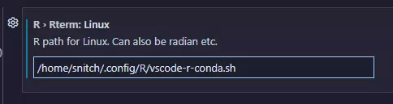
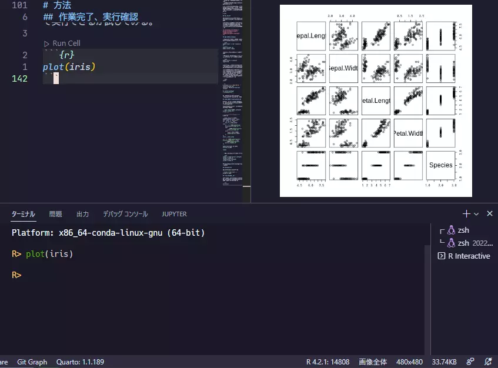

# この記事について

しばらく前に会社の計算サーバーでVSCode×conda×rmd/qmdの環境を試行錯誤して構築することができた。

作っただけで満足してしまってその後はjupyter notebookしか使わないという暴挙にでてしまっていたが、これからはquarto活用を推進していこうという気になったので、改めて環境を見直した。

## この記事を読んでできるようになること

- VSCode-R(REditorSupport)を介してrmd/qmdのチャンクをインタラクティブモードで実行する際、指定したconda環境を使うようになります。
- また、ターミナルには`radian`が使用されるようになります。

## 誰向けか

- Rのバージョンを使い分けたい人
- Rのバージョン管理にcondaを使っている人
- わけあってRのアップデートを気軽にはできない場合[^1]

# 方法

## クレジット

最初に、この解決法を知るに至った、神的なGitHub issueをクレジットしておきたい。

自分はこちらのイシュー(Rとradianをconda環境指定しつつvscode-Rで使うにはどうしたら良いか)についていたelsherbiniさんのスクリプトで成功した。



## 最小構成のconda環境

まず環境を作る。これさえあればとりあえずはvscodeでの解析環境が作れる。

``` bash
mamba create -n r42 "r-base==4.2"
# 完了後
mamba activate r42
mamba install radian
```

radianを使う気が無いなら省略してもOK。

もしjupyter Notebook環境も作りたいなら、以下のものも用意しておく。

``` bash
mamba install r-irkernel jupyterlab
```

conda-forgeレポジトリにはRパッケージも存在しており、コマンドライン上でパッケージをインストールすることは可能だ。

<mark>しかし、この後インストールが必須な`languageserver`をcondaでインストールしてしまうと、依存関係の設定ミスにより強制的にR4.1にダウングレードされてしまうので注意が必要だ</mark>。
基本的にRのパッケージはR内でインストールする方が良さそうだ。

```bash
radian
```
<br>

```r
R version 4.2.1 (2022-06-23) -- "Funny-Looking Kid"
Platform: x86_64-pc-linux-gnu (64-bit)

R> install.packages("languageserver")
```

最低限必要なパッケージはこの`languageserver`パッケージだけ。

## 起動用シェルスクリプトを作成

Windowsだと`ps1`ファイルか何かを使うのだと思うが、Linux/Mac環境しか試してないので不明。

以下の内容を適当な場所へ保存。ファイル名は何でも良い。

```bash {name="$HOME/.config/R/vscode-r-conda.sh"}
#!/bin/bash

# conda環境名はここで指定する

R_ENV=r42

\_\_conda_setup="HOME/mambaforge/bin/conda' 'shell.zsh' 'hook' 2\> /dev/null)"
if \[ ![? -eq 0 \]; then  eval \"](https://latex.codecogs.com/svg.latex?%3F%20-eq%200%20%5D%3B%20then%20%20eval%20%22 "? -eq 0 ]; then  eval "")\_\_conda_setup"
else
if \[ -f "![HOME/mambaforge/etc/profile.d/conda.sh\" \]; then  . \"](https://latex.codecogs.com/svg.latex?HOME%2Fmambaforge%2Fetc%2Fprofile.d%2Fconda.sh%22%20%5D%3B%20then%20%20.%20%22 "HOME/mambaforge/etc/profile.d/conda.sh" ]; then  . "")HOME/mambaforge/etc/profile.d/conda.sh"
else
export PATH="PATH"
fi
fi
unset \_\_conda_setup

if \[ -f "![HOME/mambaforge/etc/profile.d/mamba.sh\" \]; then  . \"](https://latex.codecogs.com/svg.latex?HOME%2Fmambaforge%2Fetc%2Fprofile.d%2Fmamba.sh%22%20%5D%3B%20then%20%20.%20%22 "HOME/mambaforge/etc/profile.d/mamba.sh" ]; then  . "")HOME/mambaforge/etc/profile.d/mamba.sh"
fi

mamba deactivate && mamba activate \$R_ENV

radian
```

一応実行可能になってるか確認する。

```bash
chmod +x /home/snitch/.config/R/vscode-r-conda.sh
/home/snitch/.config/R/vscode-r-conda.sh
```

正常にconda環境のRがradianで立ち上がればOK。

## VSCodeに登録

最後にVSCodeの登録をする。



## 作業完了、実行確認

ここまでやれば、conda環境がVSCodeの実行環境になったはず。このqmdファイルで実行できるか試してみる。

``` {r}
plot(iris)
```



バッチリ✴️

もしもバージョン変更をしたくなったら、conda環境を作り直してからシェルスクリプトの仮想環境名を変更するだけで良いので、超簡単。

[^1]: 自分の場合は数十人で使っている共有サーバーなので二三年に一度しかアプデできないし、LinuxのOS的な問題でRバージョンを上げられないという悲しい状況です。
