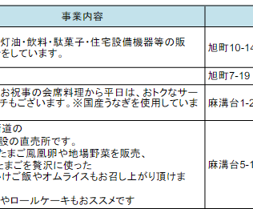
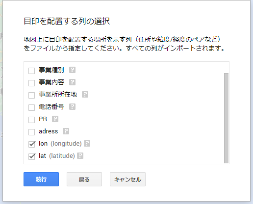

## はじめに

メインブログでは久しぶりの投稿です😄 (と言いつつサブブログにアップするかも)
試しに解説したQuartoブログの執筆が非常に快適なため、いずれ全ての記事をサブブログに移行することを検討中です。

いずれ時間ができたらQuartoとHugoで静的ブログを開設する方法についても解説記事をアップしたいと思います💡

さて、今回は相模原市の39キャンペーン加盟店のマップをRとPythonで作成します!

### 相模原市39キャンペーンとは

年に一度相模原市が開催しているキャンペーンで、15,000円以上の消費をすれば市から3,900円がキャッシュバックされるという神キャンペーン!😇
しかも家族の頭数の分だけ申請可能で、誰の買い物でもOKという、~~ガバガバ~~神仕様。😇😇

しかし、非常に残念なことに加盟店一覧情報はpdfファイルに書かれた情報しかありません･･･　このご時世にいくらなんでもお役所仕事すぎるだろ･･･ってことで私が代わりにマップを作って差し上げることにします。



## 方針

今回の方針では、①pdfファイルから表データをスクレイピング、②抽出した住所データから緯度・経度情報をGoogleMapAPIを使って取得、③GoogleMapにプロット
という流れでやっていきます。

序盤のスクレイピングですが、便利なWebツールとか、似たようなライブラリ・パッケージが山ほどありますので、正直なんでも良いです🤚今回は結果がpandas.DataFrameとして返ってくる`camelot`が便利そうだったので、これを採用しました。

自分はあんまり地図データの取り回しをやったこと無かったのですが、[瓜生さん](https://suryu.me/)の地図データ可視化のお話を昔から見させていただいた身からすれば「これはRの守備範囲だろうな」と、あまり下調べもせずRでの実装をすることにしました。

## 作り方

### pdfファイルから表データをスクレイピング

[camelot](https://camelot-py.readthedocs.io/en/master/)は今回調べて初めて使いましたが、非常にシンプルなAPIで使用できる上、[かなり詳細な設定もできる模様](https://camelot-py.readthedocs.io/en/master/user/advanced.html#)。かなりテーブル抽出に特化していますが、非常に素晴らしいライブラリだと思います🚰

ファイル書き出しの際は、一ページに存在する表がバラバラに返ってくるため、大量のファイルに分割して書き出すことになります。どうせR側でこのあと`purrr::map_dfr()`でもすれば結合できるので、気にしない😉

``` python
import camelot
import pandas as pd
from pathlib import Path
from tqdm import tqdm

def extract_table(pdfpath: str):
    # ファイル名から区名を取得する
    ward = Path(pdfpath).name

    # テーブルを抽出する
    tables = camelot.read_pdf(pdfpath, pages="all")

    # 書き出し
    for index, table in enumerate(tqdm(tables)):
        table\
        .to_csv(f"data/{ward}_{index}.csv", index=False)

for p in ["中央区.pdf", "南区.pdf", "緑区.pdf"]:
    extract_table(p)
```

抽出できたので、とりあえずファイルを読んでみます。以降の解析はRを使うことにします。

``` r
pacman::p_load(tidyverse)

read_csv("data/中央区.pdf_0.csv")
```

    New names:
    Rows: 24 Columns: 7
    ── Column specification
    ────────────────────────────────────────────────────────
    Delimiter: "," chr (7): ...1, 事業所（店舗等）名, 事業種別, 事業内容,
    事業所所在地, 電話番号, PR・オトク情報...
    ℹ Use `spec()` to retrieve the full column specification for this data. ℹ
    Specify the column types or set `show_col_types = FALSE` to quiet this message.
    • `` -> `...1`

    # A tibble: 24 × 7
       ...1  `事業所（店舗等）名` 事業種別   事業内容        事業…¹  電話…²  PR・…³
       <chr> <chr>                <chr>      <chr>           <chr>   <chr>   <chr>
     1 相生  GOGO                 飲食業     "お酒飲みなが…  相生3-… 080-47…  <NA>
     2 <NA>  U-Select相模原中央   小売業     "自動車(中古車… 相生2-… 042-75…  <NA>
     3 <NA>  うなぎ処いわき       飲食業     "飲食業"        相生2-… 042-75…  <NA>
     4 <NA>  （有）菅原塗装工房   その他     "住宅塗装"      相生3-… 042-70…  <NA>
     5 <NA>  セブンイレブン相生店 小売業     "コンビニエン…  相生4-… 042-75…  <NA>
     6 <NA>  せんざん相模原店     飲食業     "和食、海鮮料…  相生1-1 042-77…  <NA>
     7 <NA>  ソニック相模原       小売業     "家電販売、電…  相生4-… 042-75… "お見…
     8 <NA>  蕎麦とそばまえgenten 飲食業     "手打ち蕎麦屋…  相生1-… 042-76…  <NA>
     9 <NA>  パティスリーフレジェ 小売業     "手作りケーキ…  相生3-… 042-75… "手作…
    10 <NA>  ヘアーサロン セオ    サービス業 "理容業 カット… 相生4-… 042-75…  <NA>
    # … with 14 more rows, and abbreviated variable names ¹​事業所所在地, ²​電話番号,
    #   ³​`PR・オトク情報`
    # ℹ Use `print(n = ...)` to see more rows

ちゃんと抽出できているようです。元々のデータでは一列目が結合されたセルになっているため、完全な表にしたいのならパディングをすべきですが、まあ使わないので放っておきます。

### 抽出したデータをきれいにする

とりあえず、データを全部結合してみます。

``` r
df_joined <- fs::dir_ls("data") |>
  suppressMessages(
    map_dfr(function(x) {
      read_csv(x, show_col_types = FALSE) %>%
      select(2:ncol(.))
    })
  )
df_joined |>
  head()
```

    data/中央区.pdf_0.csv  data/中央区.pdf_1.csv  data/中央区.pdf_10.csv data/中央区.pdf_11.csv
    data/中央区.pdf_12.csv data/中央区.pdf_13.csv

結合は問題なくできています。事業社所在地の住所をGoogleGeometryAPIに投げれば緯度と経度が出せそうですが、できるなら「神奈川県相模原市??区」もついていた方が正確な検索結果を得られそうです。

適当にこれをコーディングしてみます。今回はファイル名から区名を取り出しつつ、結合してみます。

``` r
df_joined <- fs::dir_ls("data") |>
  map_dfr(function(x) {
    # "緑区.pdf_0.csv"から"緑区"を取り出す
    wald_name = fs::path_file(x) |>
      str_split("\\.") |>
      pluck(1) |>
      pluck(1)

  read_csv(x, show_col_types = FALSE, col_names = FALSE) |>
    magrittr::set_colnames(c("area", "事業所名", "事業種別", "事業内容", "事業所所在地", "電話番号", "PR")) %>%
    select(2:ncol(.)) |>
    mutate(adress = glue::glue("神奈川県相模原市{wald_name}{事業所所在地}"))
  })
```
プレビューしてみる。

``` r
df_joined |> head()
```

    # A tibble: 6 × 7
      事業所名             事業種別 事業内容           事業所…¹ 電話…²  PR    adress
      <chr>                <chr>    <chr>              <chr>    <chr>   <chr> <glue>
    1 事業所（店舗等）名   事業種別 "事業内容"         事業所…  電話番… PR・… 神奈…
    2 GOGO                 飲食業   "お酒飲みながら色… 相生3-4… 080-47… <NA>  神奈…
    3 U-Select相模原中央   小売業   "自動車(中古車)の… 相生2-1… 042-75… <NA>  神奈…
    4 うなぎ処いわき       飲食業   "飲食業"           相生2-1… 042-75… <NA>  神奈…
    5 （有）菅原塗装工房   その他   "住宅塗装"         相生3-1… 042-70… <NA>  神奈…
    6 セブンイレブン相生店 小売業   "コンビニエンスス… 相生4-1… 042-75… <NA>  神奈…
    # … with abbreviated variable names ¹​事業所所在地, ²​電話番号

途切れているので住所だけを抽出。

``` r
df_joined |> select(adress)
```

    # A tibble: 2,021 × 1
       adress
       <glue>
     1 神奈川県相模原市中央区事業所所在地
     2 神奈川県相模原市中央区相生3-4-20
     3 神奈川県相模原市中央区相生2-1-1
     4 神奈川県相模原市中央区相生2-16-6
     5 神奈川県相模原市中央区相生3-13-10-1F-1
     6 神奈川県相模原市中央区相生4-1-15
     7 神奈川県相模原市中央区相生1-1
     8 神奈川県相模原市中央区相生4-11-15
     9 神奈川県相模原市中央区相生1-1-18　1F
    10 神奈川県相模原市中央区相生3-14-14
    # … with 2,011 more rows
    # ℹ Use `print(n = ...)` to see more rows

よさそうです👌

### GoogleGeocodingAPIを使って住所から緯度・経度を出す

{}
ℹ️Info

GoogleGeocodingAPIは従量課金の有料サービスです。[1,000クエリで5.00USDとのこと](https://developers.google.com/maps/documentation/geocoding/usage-and-billing)ですので、今回のケースを有料でAPI叩いた場合約10USDくらい必要になります。
私は今回90日限定のフリー体験の範囲内で試しました。また、新規登録時に無料クレジットが300USDもらえたので、当分お金の心配はいらないのかなと思います。

使い方は[Google cloud](https://cloud.google.com/?hl=ja)でアカウントを作成し、**コンソール**に行き、プロジェクトを新規作成、プロジェクトを開いて**ライブラリ**に飛ぶとGoogle geocoding APIが有効化できます。APIキーは認証情報から確認できます。
{}

最初は[geocoding.jp](https://www.geocoding.jp/api/)を使う以下のようなコードを書きましたが、10秒に1回のクエリに制限する必要があったため、GoogleのAPIを使うことにしました。

``` r
pacman::p_load(rvest)

get_position <- function(adress) {
  url <- paste0("https://www.geocoding.jp/api/?v=1.1&q=", adress)

  lat <- read_html(url) |>
    html_nodes("lat") |>
    html_text()
  lng <- read_html(url) |>
    html_nodes("lat") |>
    html_text()
  lat <- if_else(is.na(lat), "0", lat)
  lng <- if_else(is.na(lng), "0", lng)
  # wait
  Sys.sleep(10)
  return(tibble(lat = lat, lng = lng))
}

get_position_vec <- function(adress_vec) {
  adress_vec |>
  map_dfr(\(vec) get_position(vec))
}
```

で、以下が本題。

``` r
library(ggmap)
```

    Google's Terms of Service: https://cloud.google.com/maps-platform/terms/.

    Please cite ggmap if you use it! See citation("ggmap") for details.

Google cloud platformからAPIキーを取得します。とりあえず今回はgeocoding APIだけ取得すればOKです。

ここにAPIキーをハードコードするわけにはいかないので別ファイルから読み込んでますが、`register_google(key = ******)`に直接入力して問題ありません👍

``` r
# APIキーはGCPから取得したもの
key <- readChar("API.key", file.info("API.key")$size)
register_google(key = key)
```

`ggmap`パッケージは`mutate_geocode()`関数でお手軽に住所検索ができます。


``` r
df_geo <- df_joined |>
    mutate_geocode(adress)
df_geo |>
    write_csv("sagamihara_geodata.csv")
```

計算が無駄にならないように書き出しておいて・・・。

できあがったファイルをみると、`lon`と`lat`という列が追加されています!　これが経度緯度のようです。
ここまで来ればあとはGooglemapに書き出すだけ😉

RでGoogleMapにピンを立てる方法はちょっと分からなかったので、GoogleMapにオリジナルマップを作成する戦法をとりました。

### GoogleMapにピンたてる

[Googleのマイマップ](https://mymaps.google.com/)にいきます。

ここで新しい地図の作成⇒レイヤのインポートを選択し、先ほど出力したファイルを食わせます。



するとマーカーのタイトルを選ぶよう言われるので、とりあえず事業所名にでも設定しておきます。
こうしてできたのが以下です!

<iframe src="https://www.google.com/maps/d/u/3/embed?mid=11zsk8DfDq288lFFTM5kz70uumV82pD4&ehbc=2E312F" width="640" height="480"></iframe>

マイマップの埋め込みリンクを取得して貼り付ければ、こんな感じでブログに載せられるので便利ですね。

## まとめ

今回は以下の作業をプログラミングでやってみました。

1. pdf内にしかない住所情報を取得
2. GoogleGeocodingAPIを使って住所から座標を取得

Googleマップと組み合わせると地図データは色々遊べそうで、面白いですね😄

相模原市にお住まいの方は、サンキューキャンペーンがあと一ヶ月あまりです!頑張って15,000円使いましょう!!