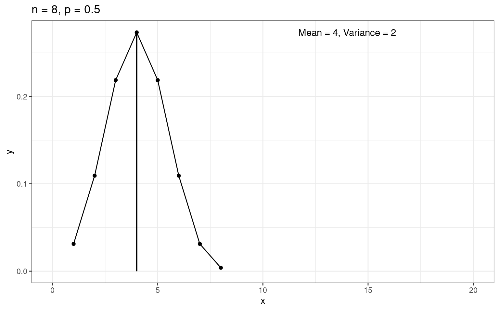
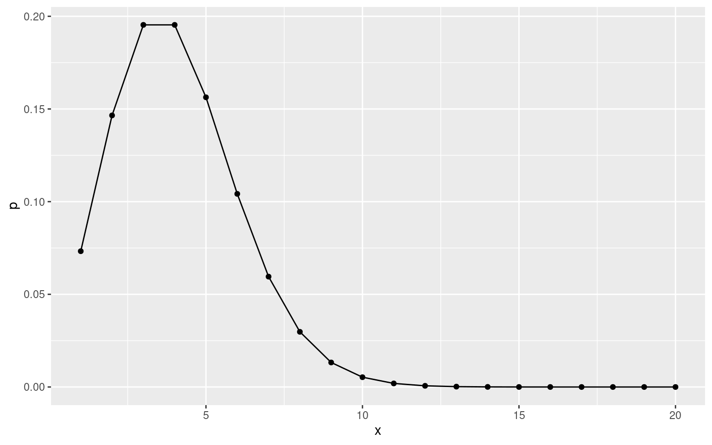
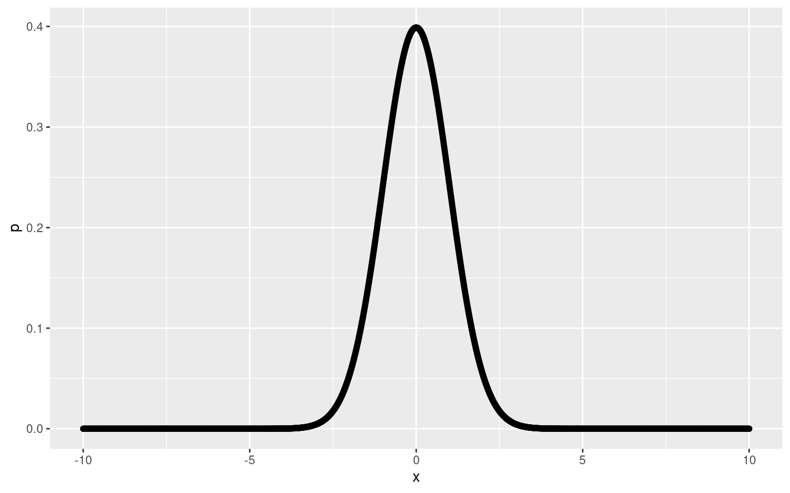
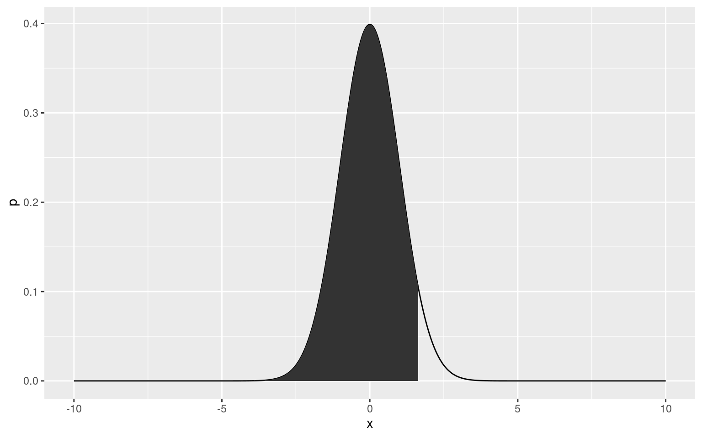
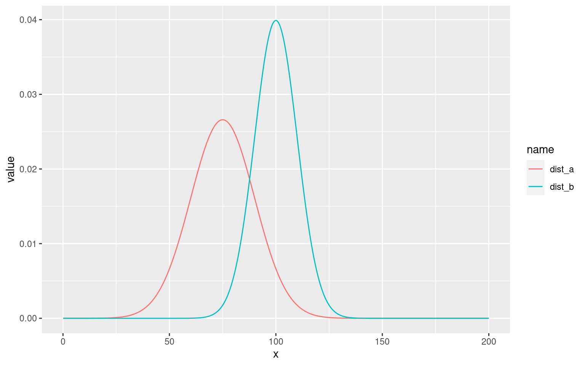

## prep

``` r
pacman::p_load(tidyverse)
```

## (1)

二項分布の確率は`dbinom()`関数で生成できる。

``` r
x <- seq(1:6)
df_1 <- tibble(
    x = x,
    y = dbinom(x, size = 6, prob = 0.25)
)
df_1 |>
    ggplot(aes(x, y)) +
    geom_point() +
    geom_line()
```


平均値と標準偏差を確率分布から求める。

標準偏差を求める関数を作っておく。

``` r
glue::glue("mean is {sum(df_1$x * df_1$y)}")
```

    mean is 1.5

``` r
val_mean <- sum(df_1$x * df_1$y)
val_var <- sum((df_1$x)^2 * df_1$y) - val_mean^2

glue::glue("variance is {val_var}")
```

    variance is 1.125

　二項分布の平均値、分散がそれぞれであることを利用した計算結果と一致する。

``` r
glue::glue("np = {6 * 0.25}")
```

    np = 1.5

``` r
glue::glue("npq = {6 * 0.25 * 0.75}")
```

    npq = 1.125

## (2)

nとpが与えられた時の二項分布の平均と分散を求める関数を作成してみる。

``` r
calc_binomial <- function(n, p) {
    x = seq(1, n, 1)
    y = dbinom(x, n, p)
    val_mean = sum(x * y)
    val_var = sum(x * x * y) - val_mean ^ 2

    tibble(x = x, y = y) |>
    ggplot(aes(x, y)) +
    geom_line() +
    geom_point() +
    geom_segment(aes(x = val_mean, xend = val_mean,
    y = 0, yend = dbinom(val_mean, n, p))) +
    theme_bw() +
    ggtitle(glue::glue("n = {n}, p = {p}")) +
annotate("text",
    x = val_mean + 10, y = max(y),
    label = glue::glue("Mean = {val_mean}, Variance = {val_var}"))
}
```

``` r
calc_binomial(50, 0.5)
```


``` r
calc_binomial(100, 0.2)
```


``` r
calc_binomial(400, 0.2)
```


``` r
calc_binomial(900, 1/3)
```


## (3)

正確な硬貨を8回投げた時の表の出る回数は二項分布に従う。

``` r
calc_binomial(8, 0.5) +
xlim(c(0, 20))
```



## (4)

二項分布の式、とは以下である。

 = {}_nC_x\cdot p^x(1-p)^{n-x}")

### (a)

\$\$
\$\$

### (b)

「たかだか２回」が解釈不能なので飛ばす。

### (c)

\$\$
\$\$

### (d)

正確な硬貨を9回投げるとき、たかだか3回表が出る確率ってほんとなんなんだろう。3回以下なのか。

## 5)

普通に二項分布として計算する。

たかだかは例によってよく分からないので飛ばす。

\$\$
\$\$

## 6)

たかだか問題によりパス。

## 7)

``` r
1 - (( 3 / 4 ) ^ 10 + 10 * 3 ^ 9 / 4 ^ 10 + 45 * 3 ^ 8 / 4 ^ 10)
```

    [1] 0.4744072

0, 1, 2回生じる確率を二項分布の式から計算し、余事象の確率を計算する。

0.4744

## 8)

不良がの確率で存在する二項分布を考える。

``` r
(898 / 1000)^10
```

    [1] 0.3410071

``` r
10 * (102 / 1000) * (898 / 1000) ^ 9
```

    [1] 0.3873354

``` r
45 * (102 / 1000) ^ 2 * (898 / 1000) ^ 8
```

    [1] 0.197981

## 9)

### (a)

``` r
prod(7:10) / prod(1:4) * 2 ^6 / 3 ^ 10
```

    [1] 0.2276076

### (b)

``` r
prod(c(8, 9, 10)) / prod(1:3) * 8 / 3 ^ 10 + 9 * 10 / 2 * 4 / 3 ^ 10 + 10 / 3 ^ 10
```

    [1] 0.01947535

## 10)

``` r
98 ^ 9 * 2 / 100 ^ 10
```

    [1] 0.01667496

``` r
9 * 8 / 2 * 98 ^ 7 * 2 ^ 3 / 100 ^ 10
```

    [1] 0.0002500202

## 11)

ポワソン分布の式は以下。

 = \frac{m ^ xe^{-m}}{x!}, m = np")


の時の")を求めれば良い。

``` r
exp(-0.1)
```

    [1] 0.9048374

これを二項分布で計算すると、

``` r
(0.98) ^ 5
```

    [1] 0.9039208

となり、おおよそ近い。

## 12)

超幾何分布で考える。今気づいたけど、`choose()`関数でコンビネーション計算できるみたい。

``` r
choose(60, 2) * choose(30, 2) / choose(90, 4)
```

    [1] 0.3013279

二項分布ならば以下。

``` r
choose(4, 2) * (2 / 3) ^ 2 * (1 / 3) ^ 2
```

    [1] 0.2962963

近からず遠からず。Nが少々少なかったか。

## 13)

``` r
m = 100 * 0.02
x = 4
m ^ x * exp(-m) / factorial(x)
```

    [1] 0.09022352

## 14)

``` r
m = 200 * 0.03
x = 5
m ^ x * exp(-m) / factorial(x)
```

    [1] 0.1606231

## 15)

動物園の入場者数は4人と比べたら相当多いはず。そのため、ポアソン分布が使えると考える。

ポワソン分布の期待値はであり、それが4なのだから、確率の計算が可能。

期待値の性質を使うというアイデアは一瞬分からなかったけど、とても便利な性質だなあ。

``` r
m = 4
x = c(1, 2, 5)
m ^ x * exp(-m) / factorial(x)
```

    [1] 0.07326256 0.14652511 0.15629345

## 16)

``` r
p = 1 / 10000
n = 20000
m = n * p

m
```

    [1] 2


## 17)

``` r
n = 200
p = 0.02

4 ^ 2 * exp(-4) / factorial(2)
```

    [1] 0.1465251

## 18)

``` r
p = 0.012
n = 300

3.6 ^ 2 * exp(-3.6) / factorial(2)
```

    [1] 0.1770577

## 19)

一冊の本で、一ページあたりの誤植数の期待値が0.05であるポアソン分布を考える。

``` r
x = c(0, 1, 2)
0.05 ^ x * exp(-0.05) / factorial(x)
```

    [1] 0.951229425 0.047561471 0.001189037

## 20)

``` r
4 ^ 1 * exp(-4) / factorial(1)
```

    [1] 0.07326256

例のごとく、たかだか問題は飛ばす。

## 21)

m = 5と指定されたポアソン分布。

### (a)

今更だけど、ポワソン分布の関数を作ろう。

``` r
poisson_func <- function(m, x) {
    m ^ x * exp(-m) / factorial(x)
}
```

``` r
poisson_func(5, 0)
```

    [1] 0.006737947

### (b)

``` r
poisson_func(5, 2)
```

    [1] 0.08422434

### (c)

``` r
poisson_func(5, 5)
```

    [1] 0.1754674

## 22)

``` r
1 - sum(poisson_func(4, c(0:5)))
```

    [1] 0.2148696

``` r
1 - sum(poisson_func(4, c(0:1)))
```

    [1] 0.9084218

ところで、これは確率密度関数がプロットしたらイメージわきやすい気がした。

``` r
library(tidyverse)

tibble(
    x = 1:20,
    p = poisson_func(4, 1:20)
) |>
    ggplot(aes(x = x, y = p)) +
    geom_point() +
    geom_line()
```



## 23)

### (a)

確率は単純にポワソン分布の式に代入すればよい。

``` r
poisson_func(3, c(1:10))
```

     [1] 0.1493612051 0.2240418077 0.2240418077 0.1680313557 0.1008188134
     [6] 0.0504094067 0.0216040315 0.0081015118 0.0027005039 0.0008101512

平均値、すなわち期待値は確率に確率変数を乗算してから合計を計算すればよい。

``` r
sum(poisson_func(3, 1:10) * 1:10)
```

    [1] 2.996693

確かに3に近い値となった。

多分手計算の都合で10までとしているのだが、とても大きい値まで計算するとどうか。

``` r
sum(poisson_func(3, 1:100) * 1:100)
```

    [1] 3

これ以上はオーバーフローしてしまうようだ。

### (b)

分散は二乗の期待値引く期待値の二乗で求める。

``` r
sum(poisson_func(3, 1:10) * (1:10)^2) - sum(poisson_func(3, 1:10) * 1:10)^2
```

    [1] 2.982299

これも大体3に近い。

同じように大きい数字まで計算してみる。

``` r
sum(poisson_func(3, 1:100) * (1:10)^2) - sum(poisson_func(3, 1:100) * 1:100)^2
```

    [1] 2.963084

うーん　これが計算の限界か。コンピュータ上だと桁数の多い小数が計算できないというのは本当だったのか。

## 24)

正規分布の確率密度関数でも、自作関数を作ってみよう。

``` r
normal_function <- function(z) {
    exp(-z ^ 2 / 2) / sqrt(2 * pi)
}
```

一応プロットして確認する。

``` r
tibble(
    x = -1000:1000*0.01,
    p = normal_function(-1000:1000*0.01)
    ) |>
    ggplot(aes(x = x, y = p)) +
    geom_point() +
    geom_line()
```



ちゃんと標準正規分布になっているようだ。いったんデータフレームにいれておく。

積分値が欲しいが、この積分値を求めるのは結構しんどい。マクローリン展開しないといけない?

と、調べてみるとRの標準関数でやる補法があるらしい。正規分布の密度(density)をintegral関数に与える。integral関数なんて・・・Rを五年以上やってて初めて聞いた・・・

### (a)

``` r
integrate(dnorm, -1, 1)
```

    0.6826895 with absolute error < 7.6e-15

わーほんとに求まったすごい。

### (b)...(f)

``` r
calc_normal_sum <- function(z) {integrate(dnorm, -z, z)}
```

``` r
c(2, 3, 1.96, 2.33, 2.58) |>
    map(\(x) calc_normal_sum(x))
```

    [[1]]
    0.9544997 with absolute error < 1.8e-11

    [[2]]
    0.9973002 with absolute error < 9.3e-07

    [[3]]
    0.9500042 with absolute error < 1e-11

    [[4]]
    0.9801938 with absolute error < 1.2e-09

    [[5]]
    0.99012 with absolute error < 1.9e-08

## 25)

確率密度関数の積分値から確率を求める問題。

Rではqnorm()がそれを実現してくれる。

``` r
qnorm(0.95, 0, 1)
```

    [1] 1.644854

ここで、0.95とは以下の部分の面積である。

``` r
tibble(
    x = -1000:1000*0.01,
    p = normal_function(-1000:1000*0.01)
    ) -> df_norm

df_norm |>
    ggplot(aes(x = x, y = p)) +
    geom_line() +
    geom_area(
        data = df_norm |> filter(x < 1.644854),
        aes(x = x, y = p)
    )
```



この点に注意して計算する。

### (a)

``` r
qnorm(0.45 + 0.5, 0, 1)
```

    [1] 1.644854

### (b)

``` r
qnorm(0.96, 0, 1)
```

    [1] 1.750686

### (c)

``` r
qnorm(0.07, 0, 1)
```

    [1] -1.475791

### (d)

``` r
qnorm(0.65, 0, 1)
```

    [1] 0.3853205

### (e)

``` r
qnorm(0.03, 0, 1)
```

    [1] -1.880794

### (f)

``` r
qnorm(0.3 + 0.5, 0, 1)
```

    [1] 0.8416212

## 26)

### (a)

`integrate()`関数を使えば確率密度関数の面積値を求めることが出来るが、標準正規分布でない場合は自作関数でwrapする必要があるのではないだろうか。

``` r
dnorm_mod <- function(x) {dnorm(x = x, mean = 10, sd = 2)}
integrate(dnorm_mod, -Inf, 13)
```

    0.9331928 with absolute error < 1.5e-05

### (b)

``` r
integrate(dnorm_mod, 6, Inf)
```

    0.9772499 with absolute error < 1.1e-07

### (c)

``` r
integrate(dnorm_mod, 6, 13)
```

    0.9104427 with absolute error < 1.3e-13

## 27)

``` r
dnorm_mod <- function(x) {dnorm(x = x, mean = 57.4, sd = 8.4)}
```

``` r
integrate(dnorm_mod, -Inf, 70)
```

    0.9331928 with absolute error < 1.5e-05

``` r
integrate(dnorm_mod, -Inf, 51.1)
```

    0.2266274 with absolute error < 9e-05

``` r
integrate(dnorm_mod, 59.5, 76.3)
```

    0.3890692 with absolute error < 4.3e-15

``` r
integrate(dnorm_mod, 44.8, 74.2)
```

    0.9104427 with absolute error < 1.3e-13

``` r
integrate(dnorm_mod, 72.1, Inf)
```

    0.04005916 with absolute error < 5.9e-07

``` r
integrate(dnorm_mod, 49, Inf)
```

    0.8413447 with absolute error < 0.00011

## 28)

``` r
dnorm_mod <- function(x) {dnorm(x = x, mean = 71.8, sd = 5.6)}
```

``` r
1 - integrate(dnorm_mod, 78.8, Inf)[[1]]
```

    [1] 0.8943502

``` r
1 - integrate(dnorm_mod, -Inf, 60.6)[[1]]
```

    [1] 0.9772499

``` r
integrate(dnorm_mod, 74.6, 80.2)
```

    0.2417303 with absolute error < 2.7e-15

``` r
integrate(dnorm_mod, 63.4, 80.2)
```

    0.8663856 with absolute error < 9.6e-15

## 29)

``` r
dnorm_mod <- function(x) {dnorm(x = x, mean = 520, sd = 10)}
```

``` r
integrate(dnorm_mod, -Inf, 500)
```

    0.02275013 with absolute error < 4.6e-05

## 30)

確率と平均値から正規分布の標準偏差を求める問題。

[参考ページ](https://www.nagwa.com/en/explainers/853196168317/)と同じように解く。

この問題はRプログラミングで解くのは難しい。(多分)

正規化する。

 = P(Z \leq \frac{86.4 - 78.0}{\sigma}) = 0.8")

標準正規分布表より、面積値が(0.5 - 0.2 = 0.3)となるようなところを探すとなので、


## 31)

先ほどと似たような形で、を考える。

1.28は確率面積値が0.4となる値を正規分布表から求めたもの。

平均値は92.98となる。

## 32)

``` r
dnorm_mod <- function(x) {dnorm(x, 60.5, 7.4)}
integrate(dnorm_mod, 70, Inf)[[1]] * 100
```

    [1] 9.960881

``` r
integrate(dnorm_mod, -Inf, 48)[[1]] * 100
```

    [1] 4.559159

``` r
integrate(dnorm_mod, 56, 64)[[1]] * 100
```

    [1] 41.03259

## 33)

正規分布において、面積値が0.9となる確率変数よりも多くの在庫を確保しておけばよい、と考える。

``` r
qnorm(0.9, 250, 30)
```

    [1] 288.4465

289以上の在庫があればよい。

## 34)

``` r
qnorm(0.95, 340, 26)
```

    [1] 382.7662

383個用意しておけばよい。

## 35)

### (a)

``` r
integrate(\(x) dnorm(x, 300, 35), 320, Inf)
```

    0.2838546 with absolute error < 2.5e-05

28.4%

### (b)

``` r
integrate(\(x) dnorm(x, 300, 35), 250, 350)
```

    0.8468725 with absolute error < 9.4e-15

84.7%

### (c)

``` r
qnorm(0.75, 300, 35)
```

    [1] 323.6071

323.6時間

## 36)

### (a)

``` r
integrate(\(x) dnorm(x, 72.8, 15), 88, Inf)
```

    0.1554505 with absolute error < 2.2e-06

### (b)

``` r
1 - integrate(\(x) dnorm(x, 72.8, 15), 32, Inf)[[1]]
```

    [1] 0.003264096

### (c)

``` r
qnorm(0.88, 72.8, 15)
```

    [1] 90.4248

### (d)

``` r
qnorm(0.25, 72.8, 15)
```

    [1] 62.68265

## 37)

イメージするために、正規分布を図示してみる。

``` r
library(tidyverse)

tibble(x = 1:2000 * 0.1) |>
    mutate(
        dist_a = dnorm(x, 75, 15),
        dist_b = dnorm(x, 100, 10)
        ) |>
    pivot_longer(-1) |>
    ggplot(aes(x = x, y = value, col = name)) +
        geom_line()
```



とは言っても、問題文をよく読むと二つの分布の関係性を気にする必要性は特になかった。

``` r
integrate(\(x) dnorm(x, 75, 15), 100, Inf)
```

    0.04779035 with absolute error < 7.9e-05

``` r
integrate(\(x) dnorm(x, 100, 10), -Inf, 75)
```

    0.006209665 with absolute error < 2.3e-05

## 38)

``` r
2400 * integrate(\(x) dnorm(x, 112, 12), 105, 125)[[1]]
```

    [1] 1394.005

回答と計算が少し違うが、おそらく正規分布表を使った事による誤差と思われる。

## 39)

正規分布の平均・分散が以下で求められることを利用する。

}")

計算すると平均が80, 分散が8と分かる。

``` r
integrate(\(x) dnorm(x, 80, 8), 0.18 * 400, Inf)
```

    0.8413447 with absolute error < 8.3e-05

## 40)

``` r
choose(14, 4) * (1 / 2) ^ 4 * (1 / 2) ^ 10
```

    [1] 0.06109619

``` r
mu = 14 * (1 / 2)
sigma = sqrt(mu * (1 / 2))

dnorm(4, mu, sigma)
```

    [1] 0.05895185

## 41)

``` r
mu = 60
sigma = sqrt(mu * (1 - 0.6))

integrate(\(x) dnorm(x, mu, sigma), -Inf, 50)
```

    0.02061341 with absolute error < 7.6e-05

## 42)

``` r
integrate(\(x) dnorm(x, 1000 / 6, sqrt(1000 / 6 * 5 / 6)), 180, Inf)
```

    0.1289495 with absolute error < 3.3e-09

``` r
integrate(\(x) dnorm(x, 1000 / 6, sqrt(1000 / 6 * 5 / 6)), 140, 200)
```

    0.9858353 with absolute error < 2.9e-09

``` r
# integrate(\(x) dbinom(x, 1000, 1 / 6), 140, 200)
```

`dbinom`はintegerしか引数にとれないらしい。integrateの計算がうまくいかなかった。

## 43)

やーっと練習問題も最後のページにたどり着いた。

``` r
integrate(\(x) dnorm(x, 0.36 * 400, sqrt(0.36 * 400 * (1 - 0.36))), 125, 400)
```

    0.9761014 with absolute error < 3.3e-05

## 44)

``` r
integrate(\(x) dnorm(x, 800*0.02, sqrt(800*0.02*0.98)), 20, Inf)
```

    0.1562111 with absolute error < 4.7e-05

## 45)

``` r
integrate(\(x) dnorm(x, 0.4 * 400, sqrt(400*0.4*0.6)), 180, Inf)
```

    0.02061341 with absolute error < 7.7e-05

## 46)

``` r
integrate(\(x) dnorm(x, 1000*0.1, sqrt(1000*0.1*0.9)), -Inf, 80)
```

    0.01750749 with absolute error < 9.1e-05

## 47)

割愛(ネットにいくらでも解説落ちてるので)

## 48)

割愛(ネットにいくらでも解説落ちてるので)

## 49)

割愛(ネットにいくらでも解説落ちてるので)

長かった。

## 所感

実際的な問題文が多かったので、正規分布を実際の出来事にあてはめるとどうなるか、というイメージを身体で覚えた感じがする。

にしても問題多かった・・。
