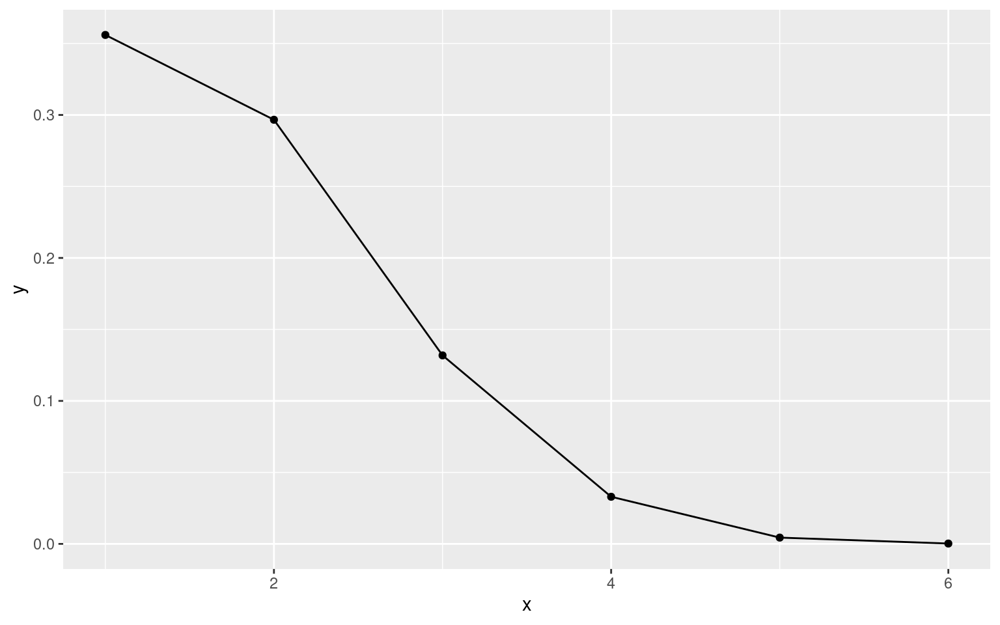
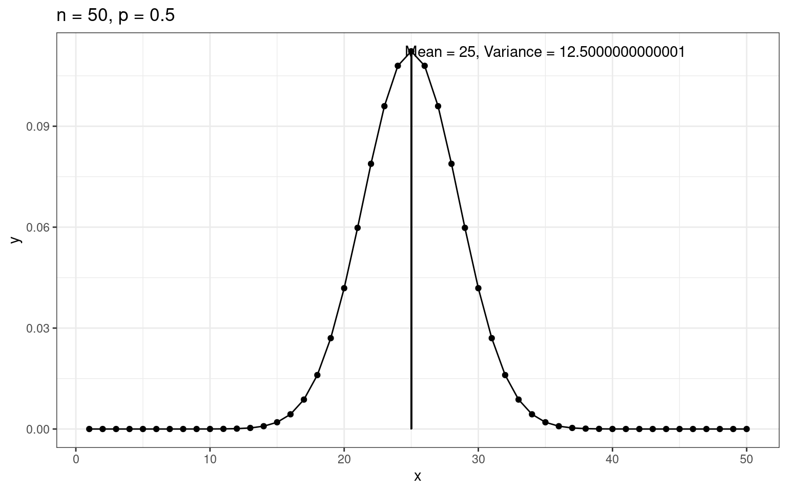
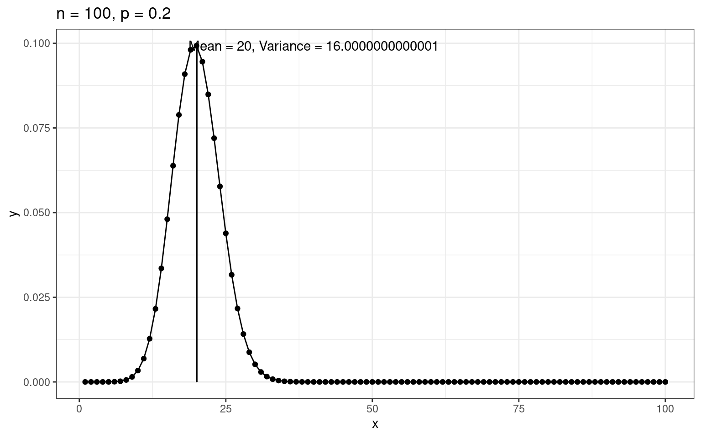
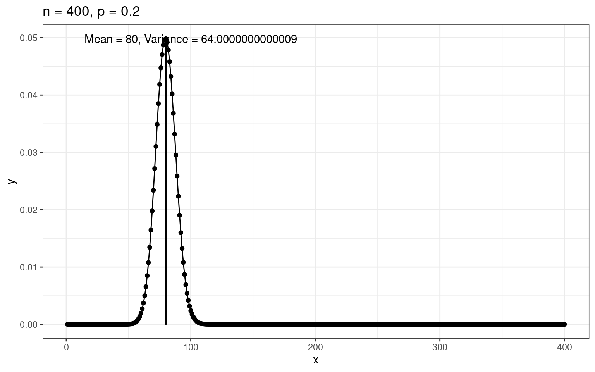
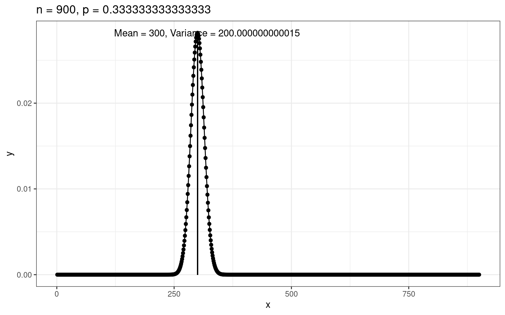

## prep

```r
pacman::p_load(tidyverse)
```

## (1)

二項分布の確率は`dbinom()`関数で生成できる。

```r
x <- seq(1:6)
df_1 <- tibble(
    x = x,
    y = dbinom(x, size = 6, prob = 0.25)
)
df_1 |>
    ggplot(aes(x, y)) +
    geom_point() +
    geom_line()
```



平均値と標準偏差を確率分布から求める。

標準偏差を求める関数を作っておく。

```r
glue::glue("mean is {sum(df_1$x * df_1$y)}")
```

    mean is 1.5

```r
val_mean <- sum(df_1$x * df_1$y)
val_var <- sum((df_1$x)^2 * df_1$y) - val_mean^2

glue::glue("variance is {val_var}")
```

    variance is 1.125

　二項分布の平均値、分散がそれぞれであることを利用した計算結果と一致する。

```r
glue::glue("np = {6 * 0.25}")
```

    np = 1.5

```r
glue::glue("npq = {6 * 0.25 * 0.75}")
```

    npq = 1.125

## (2)

nとpが与えられた時の二項分布の平均と分散を求める関数を作成してみる。

```r
calc_binomial <- function(n, p) {
    x = seq(1, n, 1)
    y = dbinom(x, n, p)
    val_mean = sum(x * y)
    val_var = sum(x * x * y) - val_mean ^ 2

    tibble(x = x, y = y) |>
    ggplot(aes(x, y)) +
    geom_line() +
    geom_point() +
    geom_segment(aes(x = val_mean, xend = val_mean,
    y = 0, yend = dbinom(val_mean, n, p))) +
    theme_bw() +
    ggtitle(glue::glue("n = {n}, p = {p}")) +
annotate("text",
    x = val_mean + 20, y = max(y),
    label = glue::glue("Mean = {val_mean}, Variance = {val_var}"))
}
```

```r
calc_binomial(50, 0.5)
```



```r
calc_binomial(100, 0.2)
```



```r
calc_binomial(400, 0.2)
```



```r
calc_binomial(900, 1/3)
```



## (3)

少しずつ書き進めます。
