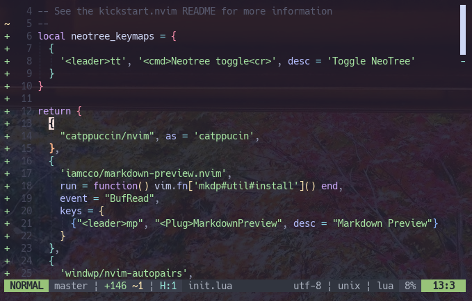
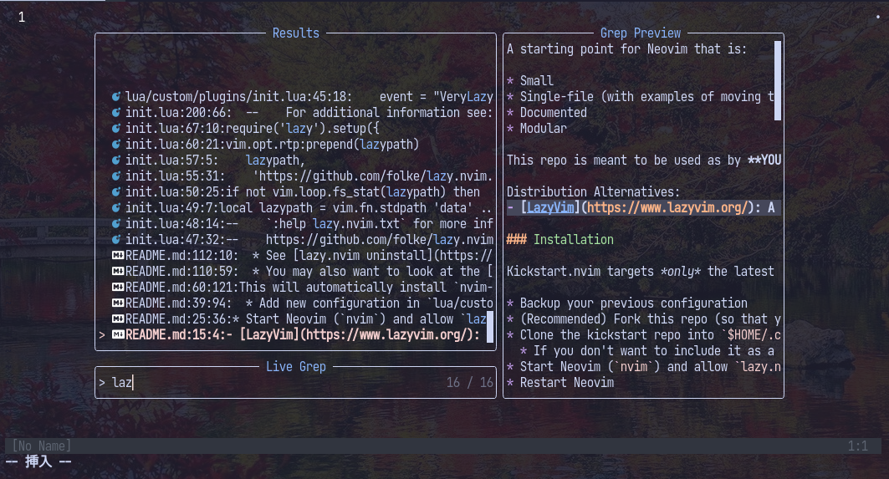

## ごあいさつ

公私ともに非常にバタバタした。いやー、本当に忙しかった！更新してなかった間にも色々気になった商品や本などがあるのでいずれ書き記していきたい。

今回は気になっていたものの一つ、Neovimの開発環境をサクッと作る`nvim-kickstart`レポジトリを試す。レポジトリのメンテナ、youtubeの解説者はNeovimデベロッパーのTJ DeVries。



## Neovimと`nvim-kickstart`


Neovimはコンソール上で動作するウルトラ軽量なテキストエディタ。かつてはEmacsとVimとの間でテキストエディタ戦争があったらしいが、Visual Studio Codeが登場したことにより多くの人はVSCodeへ移行し、戦争は終結した。



しかしVSCodeを使わないとチームでハブられる昨今でも、**マウスやカーソルキーを使うこと無くスピーディーなテキスト編集が可能**なVimエディタは根強い人気があり、コアなユーザーを中心にVimは使われ続けている。

NeovimはVimからフォークしたプロジェクトであり、VimのほとんどをLuaというプログラミング言語で書き換えたものである。独自のVimscript言語によりカスタマイズ・プラグイン開発をするVimは年々ガラパゴス化しているとの批判があるのに対して、現代的なプログラミング言語のLuaでエディタを自由自在にカスタマイズできるNeovimは柔軟かつスピーディーな開発体制もあって年々人気が高まっている。

2022年のStack Overflowにおけるアンケート調査ではNeovimが「最もユーザーに愛されているエディタ」になったことも話題になっていた。



<mark>Neovimの最大の特長は**ユーザーの好みに合わせていくらでもカスタマイズできる**</mark>点であり、Lua言語で設定ファイルを作るのはさながら波平が盆栽を手入れするかのよう。コーディングを効率化するためにテキストエディタの設定にこだわり休日が溶ける、なんてことはザラである。

「テキストエディタなんぞに時間をかけるなんて本末転倒じゃないか」と思う人も少なくないが、`nvim-kickstart`はそんな人のためにあるのかもしれない。このレポジトリではNeovimにLanguage Server Protocol(LSP)やカラースキームなどの小難しい設定がほとんど完了した状態の設定ファイルが配布されている。



今回はこのレポジトリを使ってサクッとNeovimを導入しつつ、`nvim-kickstart`のデフォルト設定を眺めていく。



### `nvim-kickstart`のクローンして一瞬で環境構築

nvimはインストール済みの前提で進める。
もしインストールしてなかったら[GitHubからnightlyをインストールして好きなところに展開](https://github.com/neovim/neovim/releases/tag/stable)するも良いし、[bobを入れておけば](https://github.com/MordechaiHadad/bob)nightlyのアップデートが楽になるのでよりおすすめ。

動画では「`init.lua`をコピペするだけで良い」と言っているが、現在では`init.lua`以外のファイルもあるのでクローンしてしまった方が良い。

`.config/nvim`がNeovim設定ファイル置き場なので、そこにクローンする。

```bash
cd ~/.config

git clone git@github.com:nvim-lua/kickstart.nvim.git nvim
```

クローンが終わったら`nvim`コマンドでNeovimを立ち上げる。すると早速パッケージマネージャの`lazy.nvim`とLSP関連のプラグインがDLされる。以上で終わり。


今までNeovimの設定ファイルを何度も自分で書き直してきたが、LDP関連のところが本当に躓きやすい。
このレポジトリはクローンしたら立ち所にLSPが使えるようになるので、本当に初心者には良い。

## kickstartの中身を理解する

kickstartのコンセプトは<mark>kickstartの中身を理解してから自分なりにアレンジしてね</mark>、ということなので頑張って中身を理解していきたい。

まずはどういう設定の仕方をしているのかと、デフォルトのキーマップなどから理解しようと思う。

### lazy.nvimについて

Neovimの醍醐味はプラグインを使って機能を拡張していくことだ。

以前は`packer.nvim`というプラグインマネージャーがスタンダードだったが、`packer.nvim`は6年の歴史があり「そろそろ新しいのが出てきても良いんじゃ無いか」という雰囲気だった。そこに登場したのが`lazy.nvim`で、これがpackerのインターフェースはそのままに、かゆいところに手が届くもんだから一気に乗り換えが進んでいる。

...ということは知ってたが、`lazy.nvim`は今回初めて使う。



基本的な書き方は以下。

```lua
require("lazy").setup(
  {
  'nvim-neo-tree/neo-tree.nvim',
  branch = 'v2.x',
  config = function ()
    require('neo-tree').setup({
    close_if_last_window = true,
    window = {
      width = 30,
    } }
  }
)　ｎ
```

`packer.nvim`とほとんど同じ使い方だが、微妙に引き数名が違う。[移行ガイド](https://github.com/folke/lazy.nvim#-migration-guide)が参考になる。

| name         | packer.nvimでの名称 | 使いどころ                       |
| ------------ | ------------------- | -------------------------------- |
| init         | setup               | インストール時に実行するコマンド |
| dependencies | requires            | 依存プラグイン                   |
| version      | tag                 | バージョン指定                   |
| keys         | keybindings         | 使い方が違う。                   |

`keys`が特に使いやすい。ここでkey-bindingsを指定しておけば、`nnoremap`しなくてもよい。
**`nvim-kickstart`ではwhich-keyが最初から入っているので、キーマップは<leader>キーから始まるものに設定し、`desc`にもわかりやすい説明文を書いておくと良い。** 勝手にwhich-keyに反映されてくれる。

```lua
  {
    'iamcco/markdown-preview.nvim',
    run = function() vim.fn['mkdp#util#install']() end,
    event = "BufRead",
    keys = {
      {"<leader>mp", "<Plug>MarkdownPreview", desc = "Markdown Preview"}
    },
  },
```

### Telescopeを使ってNeovimを縦横無尽



動画では「キーマップが分からなくなったら`:Telescope keymaps`で確認できるぜ!」と言われている。これにより確認できるが、癖の無い、使いやすいキーマップをあらかじめセットしてくれている。

`Telescope`はNeovimにしかないプラグインで、`fzf`というファジーファインダーと組み合わせることで高速な検索が実現される。検索するのはファイル中の文字、ファイル名、関数名、とにかくなんでもあり。これもセットアップするには`Telescope`のドキュメントを読む必要があったのだが、kickstartでは環境構築済みである。なんとすばらしい。

`init.lua`を覗くと以下のキーマップが登録されていた。

| keymap          | 機能                                                |
| --------------- | --------------------------------------------------- |
| \<leader>\<space> | 現在開いているバッファを探す                        |
| \<leader>?       | 最近開いたファイルを探す                            |
| \<leader>/       | 現在のファイルでfuzzy search                        |
| \<leader>sf      | 現在のディレクトリでファイルを探す([S]earch [F]ile) |
| \<leader>sh      | ヘルプを探す([S]earch [H]elp)                       |
| \<leader>sw      | 現在カーソルのあっている単語を探す([S]earch [W]ord) |
| \<leader>sg      | フリーワード検索([S]earch [G]rep)                   |
| \<leader>sd      | Diagnosticsを検索([S]earch [D]iagnostics)           |

なお<mark>`<leader>`キーは<key>space</key>キーに設定されている</mark>。

`Telescope`を使った拡張はまだまだこんなもんじゃない(はず)なので、良い使い方を見つけたらカスタムしていきたい。

### treesitter

treesitterは構文解析のプラグインである。「所詮シンタックスハイライトだけだろ?」と思っていたが、kickstartでは実に色々な活用がされていて目から鱗だった。treesitterでできるとは知らずにわざわざ別のプラグインを使ってた節もあったので、treesitterはきちんと勉強しようと思う。

| keymap    | 機能             |
| --------- | ---------------- |
| \<c-space> | 選択範囲を広げる |
| \<c-s>     | スコープを広げる |
| \<M-space> | 選択範囲を狭める |
| ]m        | 次の関数         |
| ]m        | 次の関数         |
| ]]        | 次のclass        |
| ]M        | 次の関数(outer)  |
| [[        | 前のclass(outer) |
| []        | 前のclass        |
| [M        | 前の関数(outer)  |
| [[        | 前のclass(outer) |

以下は`c`や`d`などの後に使うサブコマンド。

| サブコマンド | 機能             |
| ------------ | ---------------- |
| aa           | Around parameter |
| ia           | Inner parameter  |
| af           | Around function  |
| if           | Inner parameter  |
| ac           | Around class     |
| ic           | Inner class      |

クラスや関数は言語によって扱いやすさが違うと思う。少なくともpythonを書いている間、ビジュアルモードでクラス全体を選択したいケースはあまり発生しない。

### LSP

Language server protocol(LSP)は補完機能のあれ。Neovimをカスタムしまくってる人の画面を見ると良い感じのLSPが動いてたりするが、kickstartのLSPは必要最低限といった感じ。

ぶっちゃけNeovimでゴリゴリのコーディングをするつもりは最初から無く、VSCode Neovimを使ってVSCode用にNeovimを最適化することが目標なので、LSPまわりをカスタムする気は現状あまりない。

以下のキーマップが入っていた。

| keymap     | 機能                                                                |
| ---------- | ------------------------------------------------------------------- |
| \<leader>rn | カーソルの変数・関数名をリネーム                                    |
| \<leader>ca | コードアクション(インポートを並び替えたりなど。LSPサーバーによる。) |
| gd         | Go to definition                                                    |
| gr         | Go to reference(Telescopeで立ち上がる)                              |
| gI         | Go to Implementation                                                |
|\<leader>D  | Type Definition(pythonならクラスの定義に飛ぶ)                       |
|\<leader>ds | Document中のsymbolを全て表示(Telescopeで立ち上がる)                 |
| K          | **関数などのドキュメンテーションをホバーで表示**                    |
| \<c-k>      | ↑とほぼ同じ                                                         |
| gD         | Go to decleration                                                   |
|\<C-d>| サジェストを下へスクロール                                                                    |
|\<C-f>|サジェストを上へスクロール|
|\<C-Space>|サジェストを受け入れて補完する|
|\<Tab>|次の候補へ|
|\<S-Tab>|前の候補へ|


| keymap     | 機能                                                        |
| ---------- | ----------------------------------------------------------- |
| \<leader>wa | ワークスペースにフォルダを作成([W]orkspace [A]dd Folder)    |
| \<leader>wr | ワークスペースのフォルダを削除([W]orkspace [R]emove Folder) |
| \<leader>wl | ワークスペースのフォルダフルパスを表示                      |

## まとめ

今回はnvim-kickstartを導入してみて、モダンなNeovim設定に触れてみた。

`Lazy.nvim`の細かい使い方など、隅々までドキュメンテーション読まないと最新の書き方に追いつけないような部分もしっかり実装されているので、非常にためになった。
確か2022年暮れ～2023年明けくらいにこのレポジトリが発足したと思うが、継続的にコードはメンテナンスされているので`git pull`すれば常に最新情報に触れられるかもしれない。

次回以降はkickstartをカスタムした内容をまとめる予定。