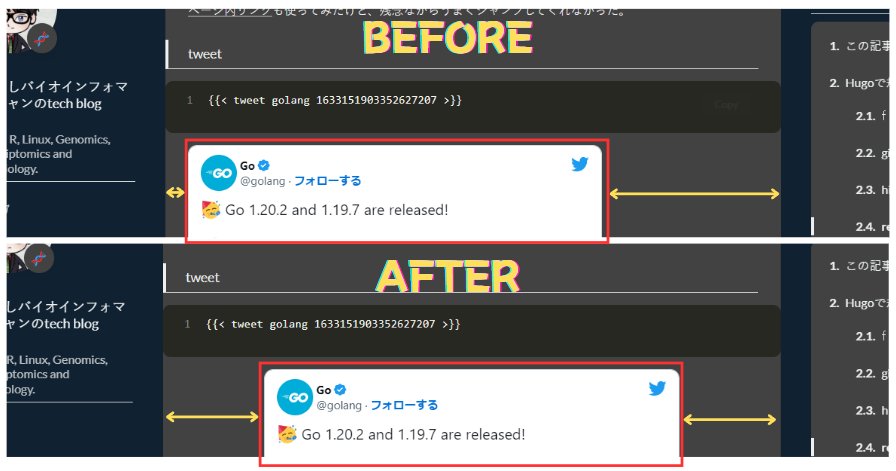

## この記事は自分のための備忘録です

[メインブログ](http://excel2rlang.com/)は執筆コストが高すぎるので、気軽にかけるこちらのHugoブログへコンテンツを集約しようと画策しています。

こちらで積極的な記事執筆に従事すべく、[`hugo-stack`theme]()にて定義されているスニペットやHugoそのもので定義されているスニペットをまとめておきます。あくまで自分用なので網羅はしていません。

自分のための備忘録ですが、`hugo-stack` themeをお使いの方の参考にもなれば。

ショートコードなどは追加するかもしれないので、随時この記事を更新します。

## Hugoで規定されているショートコード

### [`figure`](https://gohugo.io/content-management/shortcodes/#figure)

```markdown

```



Markdown記法で事足りることがほとんどなので、`figure`を使うことは無さそうです。

### [gist](https://gohugo.io/content-management/shortcodes/#gist)



gistは今回初めて使ったくらいなので、これも使うことは無いかも。使い方は簡単。

### highlight

```

...

```



def bubbleSort(array):

  # loop to access each array element
  for i in range(len(array)):
    # loop to compare array elements
    for j in range(0, len(array) - i - 1):
      # compare two adjacent elements
      # change > to < to sort in descending order
      if array[j] > array[j + 1]:
        # swapping elements if elements
        # are not in the intended order
        array[j], array[j+1] = array[j+1], array[j]
  return array

data = [-2, 45, 0, 11, -9]
sorted_data = bubbleSort(data)
print('Sorted Array in Ascending Order:')
print(sorted_data)


※AIが生成したコードなので間違ってるかもしれません(見た限り合ってるっぽいけど)

これもmarkdown記法で足りる。本当は行ハイライトなども可能ですが、stackテーマとは相性が悪いのか行番号がずれてしまいます。

### ref

```
[相模原サンキューキャンペーンの時の記事]()
```

[相模原サンキューキャンペーンの時の記事]()

サイト内リンクのURLを自動生成してくれるスニペット。

これ今まで全く活用してなかったけど、便利だし最適解だし使わなきゃだな。

[ページ内リンク]()も使ってみたけど、残念ながらうまくジャンプしてくれませんでした。

### tweet

```

```



ツイート引用もwordpressだと何かと面倒ですが、hugoのショートコードならかなり簡単に。

このブログで仕様しているstackテーマでは中心寄せのcssになっていなかったので、以下のように少し改変しました。

```css
    .twitter-tweet {
        color: var(--card-text-color-main);
        display:block;
        margin-left:auto;
        margin-right:auto;
    }
```



### youtube

```

```



youtubeもidを入れるだけでページ内ビュワーが作られます。ショート動画は左右に暗幕が出来てしまうので、あまり見栄えが良くないかも。



## 自分で追加したショートコード

### message box

```
{}
Info box.
{}

{}
Warning box.
{}

{}
Danger box.
{}

{}
Normal box.
{}
```

{}
Info box.P
{}

{}
Warning box.
{}

{}
Danger box.
{}

{}
Normal box.
{}

### blog-card

```

```



オシャンなblogカードが欲しくて過去に作ったもの。はてなのAPIを使って実装しています。

### accordion

```


import pandas as pd


```



import pandas as pd



[gkzz.devさんのブログ](https://gkzz.dev/posts/accordion-menu-hugo/)を参考にさせていただきました。

## スニペット

ショートコードの記法とは異なるが、html tagのようなスニペットが使える。

### mark
```
文章の中でも<mark>**特に強調したい部分**</mark>をハイライトできる。
```

文章の中でも<mark>**特に強調したい部分**</mark>をハイライトできる。


### sub, sup

```
文章の中で<sub>下付き</sub>や<sup>上付き</sup>を使うことが出来る。
```

文章の中で<sub>下付き</sub>や<sup>上付き</sup>を使うことが出来る。


### kbd

```
<kbd>Ctrl</kbd>キーを押しながら<kbd>C</kbd>を押す
```

<kbd>Ctrl</kbd>キーを押しながら<kbd>C</kbd>を押す