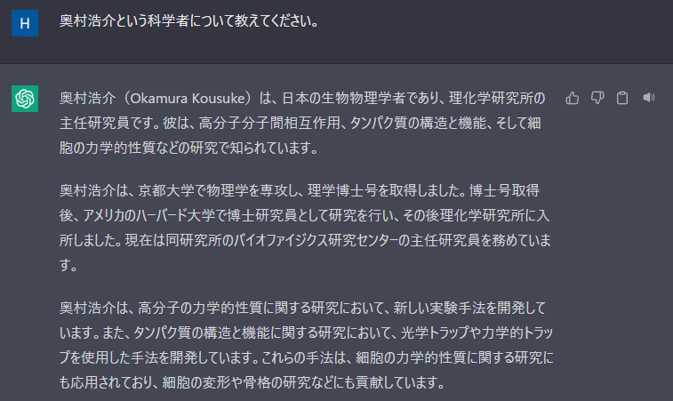
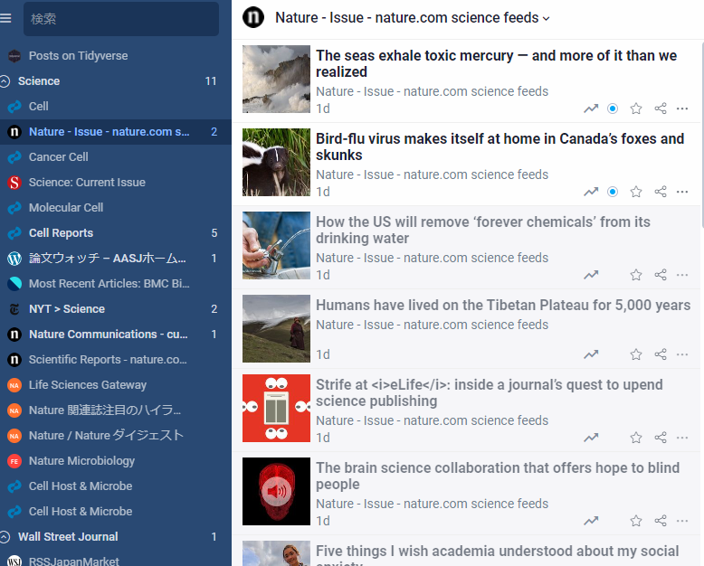
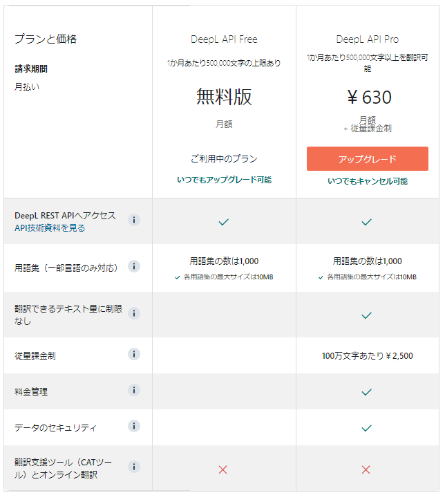
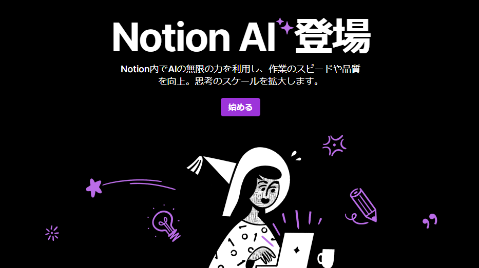
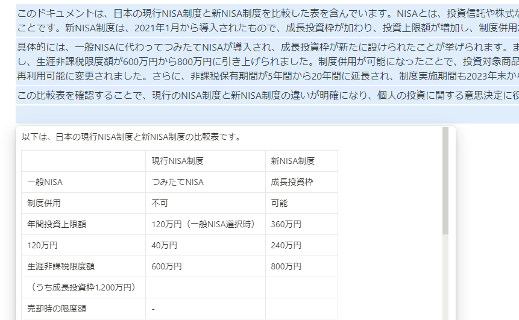
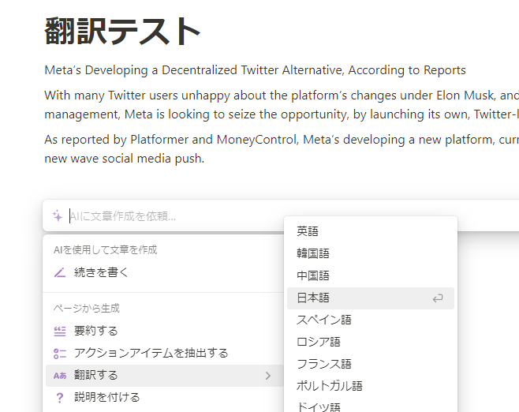

## 空前のAIブーム

この記事にたどり着いた方々には言うまでも無いと思うけど、記事作成時点ではGPT-4が発表された直後で、[Microsoft](https://www.nikkei.com/article/DGXZQOGN1653T0W3A310C2000000/)や[Google](https://thebridge.jp/2023/03/google-announces-new-generative-ai-lineup-in-advance-of-microsofts-rumored-gpt-4-debut)が自社プロダクトにAIコンテンツ作成機能を標準搭載することを発表するなど、大盛り上がりです。

昨年12月にChatGPTが公開されてちょっと試した時の感想は、「**なんか凄まじく自然な会話してくるけど、こいつ結構嘘つくな**」でした。息をするかの如く嘘を吐くため、まだシンギュラリティとは言えないかな～と思っていました。




ちなみに、シンギュラリティを「人工知能が人類を越えた瞬間」と定義したのはレイ・カーツワイルで、
<b><a href="https://www.amazon.co.jp/%E3%82%B7%E3%83%B3%E3%82%AE%E3%83%A5%E3%83%A9%E3%83%AA%E3%83%86%E3%82%A3%E3%81%AF%E8%BF%91%E3%81%84-%E3%82%A8%E3%83%83%E3%82%BB%E3%83%B3%E3%82%B9%E7%89%88-%E4%BA%BA%E9%A1%9E%E3%81%8C%E7%94%9F%E5%91%BD%E3%82%92%E8%B6%85%E8%B6%8A%E3%81%99%E3%82%8B%E3%81%A8%E3%81%8D-%E3%83%AC%E3%82%A4%E3%83%BB%E3%82%AB%E3%83%BC%E3%83%84%E3%83%AF%E3%82%A4%E3%83%AB/dp/414081697X">著書「シンギュラリティは近い　人類が生命を超越するとき(2016)」</a></b>がもとになっているらしい。今Amazonでポチった。後で読む。




今年に入ってからは「ChatGPTでこんなことさせてみた」系の記事が増えてきて、2月末くらいには"Prompting"(欲しい情報をAIから引き出すための、良い質問の仕方)みたいなものが成熟してきたように思います。

この時点ですら私はまだ懐疑的で、**いずれAIは質問の意図もうまく汲んでくれるようになるんだからPromptingを研究するなんて時間の無駄だろう**と思っていました。だからChatGPTは遊び程度にしか使っていなかった。

しかし三月に入って少々暇ができた折、NotionAIやPerplexity、Phindといったサービスに触れてみたところ<mark><b>AIサービス使いこなせないと俺が失業する</b></mark>というか、<mark><b>完璧なPromptingで調教されたAIは既に俺の能力を上回っている</b></mark>という強い危機感を感じるまでに質が高かったので、慌てて勉強を始めました。

## 今回検討したこと ⇒ 翻訳機

Promptingも勉強していますが、まずは足下の作業効率UPからはじめようと思い英語の翻訳に取り組むことにしました。

私が英語翻訳機能を欲するときは以下のような時です。

- ネットサーフィン時    ⇒ deeplのChrome拡張で満足している
- 論文を読みこむ時  ⇒ ちょこちょこdeepl使いつつ原文で読むのでChrome拡張で良い
- 論文探しをするとき    ⇒ **Inoreader上で日本語で素早くザッピングしたい**
- ニュースサイトを読んでるとき  ⇒ **よほど読み込みたい場合でなければ日本語で素早く読みたい**

一番改善したいのが、RSSリーダーのInoreaderでニュースを漁っている時。どうしても英語が母国語ではないので、英語タイトルが並ぶ**目が滑る**んですよね。



今の自分のニーズとしては**それなりにボリュームのある記事・論文**を**なんらかのアプリケーション上で**、<b>手っ取り早く読みたい(要旨が分かれば良い)</b>という形に落ち着きそうなので、基本的にはDeeplコピペだとかChrome拡張を使うなどではなく、APIを使ってプログラムを走らせる前提で検討してみることにしました。

## 翻訳機の候補者たち

### DeepL

翻訳といったらこれ！もう日本人研究者でDeepLを知らない人はいないのでは？

DeepLが有名になる前は「[みらい翻訳](https://miraitranslate.com/trial/)」というツールを良く使ってましたが、最近ではDeepLの方が使い勝手が良くなってしまいました。

無料と有料のAPIが提供されています。無料でも500,000単語までいけるので、本格的に業務利用しない限り無料APIで事足りる可能性が十分あります。


参考までに、<u><a href="[url](https://blog.fostergrant.co.uk/2017/08/03/word-counts-popular-books-world/)">ハリーポッターシリーズ全部の単語数を会わせても1,084,170単語</a></u>であることを踏まえると、500,000単語はすさまじく多い気がする。




DeepLの難点は、やはり字数制限があるところでしょうか。実際に運用してみないと分からないものの、私がInoreaderでサブスクライブしているフィードを通じて目にする論文だけで週に500本くらい、海外ニュースサイトの記事は一日で1000本くらいあります。全部を全文翻訳しないにせよこれを全て翻訳したら大変なことになりそうです。

### OpenAI API

ChatGPTをちょこちょこ使ってますが、翻訳もそれなりにできるそうなので試してみました。

APIは有料です。今回使用したモデルは[1K token使っても$0.02](https://openai.com/pricing)。なーんだ安いじゃんと思いきや、[トークンとはなんぞや](https://zenn.dev/umi_mori/books/chatbot-chatgpt/viewer/how_to_calculate_openai_api_prices)と調べると、記事一本で普通に1K token使ってもいっちゃいそうです。普通にChatするだけなら文字数少ないのでトークンも少なくて済むのに、翻訳は大量の文章を投げざるを得ないのでコストが嵩んでしまう模様。

ちなみに、今回の検討で何度かネット記事をAPIに投げましたが、現時点での支払い額は`$0.11`となっています。**お試しでこれくらいなので先行きが不安です・・・**

### NotionAI



NotionAIはライティングツールのNotionで使えるツールです。文章の要約、翻訳、あるいはゼロからの記事作成などが可能なサービスで、既存のNotionプランとは別に\$ 10/mo.(年払いディスカウント有)がかかります。

私はもう二三年くらいNotionを愛用していて、proプランに課金し続けていて、タスク管理やアイデアノート、Wordに起こす前の草稿作成などに使っています。JTC企業研究員という仕事柄、ガチの業務文書はNotionに書かないようにしていましたが、ボヤっとした備忘録的な日誌として業務内容を書いたりはしていました。

そんなNotionにもAI執筆が搭載されたわけですが、最近のMicrosoftやGoogleのムーブを少し先取りしていたような感じで、リリース当初は結構斬新な機能だったと思います。この文章を表に変換、みたいな操作ができますからね。少し使ってめちゃくちゃ便利だと思ったので即課金しました。



## いざ翻訳テスト！

今回は適当な新聞記事を選んできました。選んだのは[Meta社がTwitterライクアプリを作成中？ということを報じた記事](https://www.socialmediatoday.com/news/Meta-Developing-Decentralized-Twitter-Alternative/644730/)です。



権利的に配慮して、冒頭だけを引用します。

>Meta’s Developing a Decentralized Twitter Alternative, According to Reports
>
>With many Twitter users unhappy about the platform’s changes under Elon Musk, and amid a growing push towards a new approach to social networking, with alternative systems of moderation and management, Meta is looking to seize the opportunity, by launching its own, Twitter-like social app, which will be focused on short, text-based updates.
>
>As reported by Platformer and MoneyControl, Meta’s developing a new platform, currently titled ‘P92’, which sounds very similar to a Twitter feed, and interestingly, would be decentralized, aligning with the new wave social media push.

久方ぶりに自力で日本語訳を試みます。

>メタ社が分散型ツイッター代替アプリを開発中、報道
>
>イーロンマスクのもとでTwitterというプラットフォームが変わってしまったことを多くのTwitterユーザーが嘆いている今の状況、そして新しい形のモデレーションやマネージメントシステムをもったソーシャルネットワーキングの新しいアプローチの開発を迫られている状況で、メタ社はTwitterライクなソーシャルアプリを自社でローンチする機会を掴もうとしています。このアプリは短文の、テキストベースの更新に焦点を当てられたものになるでしょう。
>
>PlatformerとMoneyControlで報じられたように、メタ社は今のところ「P92」と名付けられている新しいプラットフォームを開発中です。これはTwitterのフィードに非常によく似たものになりそうであり、また興味深いことに分散型であり、ソーシャルメディアの新しいトレンドの波に乗ったものになると言えるかもしれません。
>

英語で書かれた記事を頻繁に読むわけではないのですが、上から下まで一読できるような文法をあえて使っているのかな、という気がしました。口語的というか。

では、この文章をAIに投げて翻訳させてみます。

### DeepL

まずDeepL APIを使ったバージョンです。今回はフリー版を使っての実装です。なお、<mark>このコードはChatGPTが生成したコードをほんの少しだけ修正しただけのものです</mark>。

```python
import requests  # type: ignore
import argparse


parser = argparse.ArgumentParser(description="Translation tool using DeepL API")
parser.add_argument("-i", type=str, help="Input file path")
parser.add_argument("-o", type=str, help="Output file path")
args = parser.parse_args()

with open(args.i, "r") as f:
    text = f.read()

with open("deepl.key", "r") as f:
    auth_key = f.read().strip()

target_language = "JA"
source_language = "EN"

url = "https://api-free.deepl.com/v2/translate"
params = {
    "auth_key": auth_key,
    "target_lang": target_language,
    "source_lang": source_language,
    "text": text,
}
response = requests.post(url, data=params)


translated_text = response.json()["translations"][0]["text"]

with open(args.o, "w") as f:
    f.write(translated_text)

```

DeepLのドキュメンテーションも読まずにコード実行したところ403エラー。調べたところフリー版と有料版とではURLが異なるらしく、そこだけ修正しました。

#### DeepLライブラリを使った別の実装

記事書きながら公式のドキュメント読んでたら気づきましたが、[python用の公式ライブラリ](https://github.com/DeepLcom/deepl-python)があったんですね😢

こちらの方が簡単そうだったので、サクッと実装してみました。

```python
import deepl
import argparse


parser = argparse.ArgumentParser(description="Translation tool using DeepL API")
parser.add_argument("-i", type=str, help="Input file path")
parser.add_argument("-o", type=str, help="Output file path")
args = parser.parse_args()

with open(args.i, "r") as f:
    text = f.read()

with open("deepl.key", "r") as f:
    auth_key = f.read().strip()

translator = deepl.Translator(auth_key)

target_language = "JA"

result = translator.translate_text(text, target_lang=target_language)

with open(args.o, "w") as f:
    f.write(result.text)
```

非常にpythonicで良い実装になったと思います。

#### 結果

>Metaが分散型Twitterの代替案を開発中との報道あり
>
>イーロン・マスクのもとでのTwitterの変化に不満を持つユーザーが多い中、モデレーションや管理システムなど新しいソーシャルネットワークのあり方を模索する声が高まる中、メタは、短いテキストベースの更新に焦点を当てた独自のTwitterライクなソーシャルアプリを発表し、この機会を捉えようと考えています。
>
>PlatformerやMoneyControlが報じたように、Metaは現在「P92」と題された新しいプラットフォームを開発中で、Twitterフィードに非常に似ているように聞こえるが、興味深いことに、分散型であり、新しい波のソーシャルメディアの推進に沿うものである。

完璧です:star2: ところどころ自分の翻訳がおかしいところに気づかされます。

細かいところの翻訳漏れがなく、タイトルも記事っぽい言い回しへと自動で言い換えているところが素晴らしいと思います。

全く問題ないので、普段使いに採用しても全く問題なし。

### ChatGPT

OpenAIのAPIには[様々なモデル](https://platform.openai.com/docs/models)が用意されています。はじめはGPT-3.5のdavinciを使って試しましたが、なぜか長文の結果を出力することができず途中で途切れてしまったため、GPT-3.5-turboを使用しました。前者は一つのプロンプトだけを投げる用、後者は対話のプロンプト形式用です。<mark>以下のコードもChatGPTにて生成したコードを少しだけ改変したものです</mark>。

```python
import openai
import argparse

openai.api_key_path = "api.key"

parser = argparse.ArgumentParser(description="Translation tool using OpenAI-api")
parser.add_argument("-i", type=str, help="Input file path")
parser.add_argument("-o", type=str, help="Output file path")
parser.add_argument("--model", default="text-davinci-002")
args = parser.parse_args()


def translate_text(input_text):
    response = openai.ChatCompletion.create(
        model="gpt-3.5-turbo",
        messages=[
            {"role": "system", "content": "あなたはプロの翻訳家です。"},
            {"role": "user", "content": f"以下の文章を英語から日本語に翻訳してください。 {input_text}"},
        ],
    )
    return response["choices"][0]["message"]["content"].strip()


with open(args.i, "r", encoding="utf-8") as f:
    input_text = f.read()

translated_text = translate_text(input_text)

with open(args.o, "w", encoding="utf-8") as f:
    f.write(translated_text)

```

#### 結果

>報道によると、Meta社は分散型のTwitterの代替案を開発しています。
>
>Elon Muskの下でプラットフォームの変更に不満を持つTwitterユーザーが多く、代替的なモデレーションや管理システムに向けた押しの中で、Meta社は自社のTwitterライクなソーシャルアプリを立ち上げることでこの機会をつかもうとしています。
>
>PlatformerやMoneyControlによると、Meta社は現在「P92」という名称の新しいプラットフォームを開発中で、Twitterフィードに非常に似ており、興味深いことに分散型であり、新しいソーシャルメディアの波に合致しています。

DeepLに比べるとワンランクダウンした感じがします。しかし、Google Translateに比べたらよっぽどマシな性能です。

「～に向けた押しの中で」といか、「新しいソーシャルメディアの波に合致しています」という部分は翻訳に苦労していそう。

とは言えこれは全然アリです。普段使い用のAPIにしても良いくらい。

### NotionAI

NotionAIはNotionのページ内で起動します。APIでは使えないので比較対象にならなそうですが、「記事をNotionにスクラップして、NotoinAPIで自動翻訳」という荒技が可能です。これはこれで実用的なソリューション。


NotionはProアカウントにアップグレードすることで無制限に画像等をアップロードできるようになります。インターネット記事をスクラップし放題になるというこの恩恵があるから私はお金を払い続けています。




#### 結果

>報道によると、Metaは分散型のTwitter代替アプリを開発しているとのことです。
>
>Elon Muskの下でプラットフォームの変更に不満を持つ多くのTwitterユーザーや、モデレーションや管理の新しいアプローチに向けた新しいソーシャルネットワーキングシステムの成長の中、Metaは機会をつかむために、短いテキストベースの更新に焦点を当てたTwitterのようなソーシャルアプリを立ち上げることを計画しているようです。
>
>PlatformerやMoneyControlによると、Metaは現在「P92」というタイトルの新しいプラットフォームを開発中で、Twitterのフィードに非常に似ており、興味深いことに分散型になる予定で、新しいソーシャルメディアの流れと一致しています。

翻訳内容は間違ってはいないのですが、人に読ませる文章としてはどこかぎこちない。というか、一読してもなんか頭に入ってこない。

>Elon Muskの下でプラットフォームの変更に不満を持つ多くのTwitterユーザーや

この文章は本来、「～という状況」かつ「～という状況」の中で「MetaはTwitter代替アプリを開発」という長い一文の冒頭部分なので、「～や」と次に続く文章を示唆する助詞を使うと読み手にはわかりにくくなってしまいますよね。これでは実用レベルとはいえません。

### 番外編 Google Translate

#### 結果

「Google Translateは使い物にならん」前提で書いてきましたが、実際のところどうなんでしょう？

気になったので試してみました。

>報告によると、Meta は分散型 Twitter の代替手段を開発中
>
>多くの Twitter ユーザーが Elon Musk の下でのプラットフォームの変更に不満を持っており、モデレーションと管理の代替システムを使用したソーシャル ネットワーキングへの新しいアプローチへの圧力が高まる中で、Meta は独自の Twitter のようなサー>ビスを開始することで、この機会をつかもうとしています。 短いテキストベースの更新に焦点を当てたソーシャルアプリ。
>
>Platformer と MoneyControl によって報告されたように、Meta は現在「P92」というタイトルの新しいプラットフォームを開発しています。これは Twitter フィードに非常に似ており、興味深いことに、新しい波のソーシャル メディア プッシュに合わせて分散化されるでしょう。

意外に悪くない・・・？と思いきや、一番肝心の「分散型」というキーワードを知らないせいか、かんか直訳感があります。

NotionAIよりはすらすら読めるような気がするような・・・🤔？

「新しい波のソーシャル　メディア　プッシュに会わせて分散化されるでしょう」

にしても、この文章はいくらなんでも謎ｗ　Google Translateは相変わらずな感じ。

## 結論:やっぱりDeepLが最強

DeepLは読みやすいし、内容がすらすら頭に入ってくる。それ以外は読んでいくと途中でつまづくような、そんな違和感がありました。

OpenAIのAPIも今回初めて使ってみましたが、意外にお金がかかることに気がつきました。本格的に業務利用するまでは控えておこう。

今度はDeepLAPIでInoreaderのヘッドラインを自動翻訳する仕組みを作りたい。