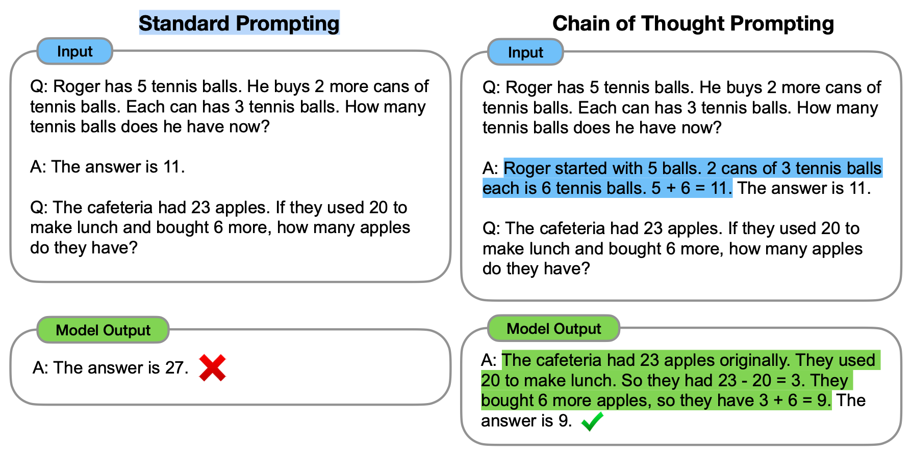

## この記事のテーマ

ChatGPTの時代が来てるな、と実感してから二週間。**これが活用できないと社会的に死ぬ**というかなり強い危機感によりAIを活用する方法を調べていました。

**AIを活用することは即ちプロンプティングスキルを伸ばすということ**です。

ブロンプティングとはAIへの命令文のことですが、命令の仕方でAIが用意してくれる情報の質が大きく変わってきます。それゆえ、プロンプティングを学ぶ必要があるのです。

そしてこの二週間を様々なサイトでプロンプティングを勉強した末、私が行き着いた答え。それは、**AIが<mark>「全く空気が読めない、お節介だけど、20~30歳くらいの超賢い社会人」</mark>であると想定して話すこと**です。

今回はプロンプティングについて勉強をして重要だと思ったことを列挙しつつ、私なりのAIとの接し方にどうやって行き着いたのか、まとめてみようと思います。

## プロンプティング

### プロンプティングとはなんぞや

プロンプティングとはAIに対して指示を出す命令文のことで、AIのパフォーマンスや出力品質に大きく影響します。ChatGPTに「ブログを書いて」とか「メールの返信文を考えて」などという依頼をしている人がそれなりにいると思われますが、**良い指示の出し方をすると目に見えて優れた結果を得られる**ようになります。<mark>人間と一緒で、言い方が大事です。</mark>

画像生成AIとして有名なMidjourneyを例に取りましょう。たとえばクリスマスツリーを擬人化したいとします。ちなみにこのお題は、妻に「何の画像が欲しい？」と聞いたらでてきた謎のお題です。

まず最初にそのまま指令(プロンプト)を投げてみます。

```
/imagine Anthropomorphic Christmat tree
```


結構気持ち悪い画像ができあがりました👾私が想像する擬人化クリスマスツリーはかわいい感じのイラスト系だったので、ちょっと違和感があります。今度はプロンプティングを活用しつつ詳しい指示を与えてみます。

```
/imagine Anthropomorphic Christmat tree, cel anime, manga, cute, friendly, smooth, white background
```


これだけで何かのコラボキャンペーンのイラストとして使えそうな感じになりました。このように、自分が思う必要な要素をどんどん継ぎ足して理想の画像を作るのがMidjourneyの面白さです。そして、**「これを入れるとこうなる」みたいなイディオムを活用することがプロンプティングに相当します**。ちなみに、cel animeは日本っぽいアニメのテイストを表現する単語です。

ちなみに、Bingとdalleに書かせると以下のようになりました。Bingいいなあ🤔


では、ChatGPTではどうか？ChatGPTも昨年末に発表されて以来、たくさんのプロンプティング研究がされています。何を隠そう、ChatGPTの開発元であるOpenAI自身が、このプロンプティングの方法について研究し、論文にまとめているくらいです。

今回は以下の3通りのパターンでプロンプティングのコツをまとめてみたいと思います。


以下の文章の大半はChatGPTに書かせました。どうやってこれを出したかについても言及します。


#### 明確な指示

AIに求めるタスクや回答を具体的に明示することで、曖昧さを減らし、より適切な結果を得ることができます。指示が明確であればあるほど、AIはユーザーの期待に沿った回答を生成しやすくなります。

<u>例:</u>

不明確な指示: 「有名な建築物について教えて。」



>世界にはたくさんの有名な建築物があります。ここではいくつかの例を挙げます：
>
>エッフェル塔 (フランス) - この象徴的な鉄の塔は、1889年のパリ万博を記念して建てられました。高さは330メートルで、現在もパリのシンボルとして親しまれています。
>
>自由の女神像 (アメリカ合衆国) - この巨大な銅像は、フランスがアメリカ合衆国の独立100周年を記念して贈呈したもので、ニューヨーク市のリバティ島に立っています。
>
>コロッセオ (イタリア) - ローマ帝国時代に建てられたこの円形闘技場は、古代ローマの建築技術の傑作とされています。現在は観光名所として人気があります。
>
>グレートウォール (中国) - この古代の城壁は、中国の北部を東西に横切るように伸びており、その長さは合計で2万キロメートル以上にもなります。防衛目的で建設されましたが、現在は世界遺産として観光客に人気です。
>
>ピラミッド (エジプト) - ギザのピラミッドは、古代エジプトの王家の墓として建てられた建築物で、現存する古代世界の七不思議のうちのひとつです。
>
>シドニー・オペラハウス (オーストラリア) - オーストラリアのシドニー港に位置するこの建築物は、20世紀の建築の傑作とされており、独特の形状が特徴です。
>
>タージ・マハル (インド) - この白い大理石の建築物は、インドのアーグラに位置し、17世紀にムガル皇帝シャー・ジャハーンが妻のために建てた墓所です。
>
>これらの他にも、世界各地に様々な有名な建築物が存在しています。建築や歴史に興味があるなら、これらの素晴らしい建築物を訪れることをお勧めします。



明確な指示: 「フランスのエッフェル塔の歴史と建設に関する情報を教えてください。」



>エッフェル塔は、フランスの首都パリにある有名な建築物で、1889年に建設されました。当時、フランスはパリ万博（エクスポ）を開催することが決まっており、その目玉となる斬新な建築物が求められていました。エッフェル塔は、その目的を果たすべく建てられたものです。
>
>エッフェル塔の設計者は、フランスの建築家と技術者であるガストン・エッフェルです。彼の設計による塔は、鉄を主材料とした構造物で、全高は約330メートルです。当時、これほどの高さを持つ建築物は他になく、世界最高の建造物として有名になりました。その後、1930年にニューヨークのクライスラービルが完成するまで、エッフェル塔は世界一高い建造物でした。
>
>エッフェル塔の建設は、1887年に始まり、1889年に完成しました。建設には約2年と2ヵ月の時間がかかり、7000トンもの鉄と250万本のリベットが使用されました。建設には、300人の労働者が働き、幸いにも建設中の事故は1件しか報告されませんでした。
>
>当初、エッフェル塔は一時的な建築物として計画されており、20年後に解体されることが予定されていました。しかし、その後の技術革新により、無線通信のアンテナとして利用されるようになり、解体されることはありませんでした。エッフェル塔はその後も、観光名所や科学研究の場として活用されています。
>
>現在、エッフェル塔はフランスやパリの象徴とされ、年間約700万人の観光客が訪れる人気の観光地です。展望台からは、パリ市内の素晴らしい景色を楽しむことができます。



不明確な指示では、AIがどの建築物について情報を提供すべきか分かりません。一方、明確な指示では、具体的な建築物（エッフェル塔）とその情報の範囲（歴史と建設）がはっきりしているため、AIは適切な回答を提供しやすくなります。

これは即ち、<mark>**事前に我々がどんな指示を与えるかについて詳細に考えておく必要がある**ということを意味していると思います</mark>。

資料作成の際には、とりあえずファイルを作り始めてから考えると言うこともありますが、これからの時代、作業時間は大幅に短縮されますので、スタート時点で完成形を詳細にイメージしておく必要があるのではないでしょうか？

#### 思考の連鎖

プロンプトエンジニア達の間では<mark>**COT: Chain of Thought**</mark>と呼ばれるやり方があります。

この方法ではQ&Aのパターンを例示して見せてやることで、思考を順序だてて行わせる方法です。嘘をつきがちなChatGPTの虚言癖を治し、論理的に正しいことを言わせるには有効な方法です。



たとえば、子供に何かを教えようとしたとき、クイズを出したとします。しかし子供はそれにうまく答えることが出来ない。そんなとき、「ばかだなあ」とか「不正解。正しくはこうだ。」と言うのはひどい親だと思います。私だったら「うーん、ちょっと違う。この場合だったらどうだろう？」と別の例を示して、自分で真理にたどり着けるように誘導してやります。

AIにそこまで気を遣う必要があるのか？と最初は私も思いましたが、**AIとのプロンプトも一種のコミュニケーションと考えれば納得できるはずです。**。

#### ステップバイステップ

また、2023年3月24日の日経電子版でも「ChatGPTを賢くする呪文」として紹介されていたのが`Let's think step by step`です。これを文末に付けるだけで、結果が改善することがあります。



非常にシンプルですが、この呪文はChatGPTが苦手とする算数の計算などで、効果を発揮することが知られています。ChatGPTはなぜか単純な四則演算を頻繁に間違えるのですが、そういった計算を一つ一つのステップごとに分けて論理的に考えさせるのです。

この手法は<mark>**Zero Shot Chain of Thought**</mark>とも呼ばれます。

実務に活かすならば、例えば上司にメールを送りたい時、上司がどういう人物で、私がどういう間柄なのか、そして上司には何を伝えたいのか、どういう背景情報があったのか？ということを事細かに順序を立てて説明する必要があるということです。

相手が人間でも同じですよね。<mark>**丁寧すぎるくらいに順序だててお願いをすれば意思疎通に齟齬は起きにくいということです。**</mark>

## まとめ

というわけで、今回はChatGPTのプロンプティングについて調べました。いろいろなサイトを参考にして調べた結論としては、相手を人間だと思って丁寧にお願いをすることが重要だと思いました。

もちろん丁寧というのは丁寧な口調で言えということではなく、順序立てて必要な情報を省略せずに伝えることです。

こうして考えてみると、<mark>**ChatGPT対するプロンプティングというのは、人とのコミュニケーションと全く同じ**</mark>ということです。相手がAIだと侮って適当な命令をすれば自分の希望道りの結果は得られませんし、相手が大切な人だと思って丁寧に一個ずつ説明すれば、非常に良い結果が返ってくることがあります。

<mark>**部下や後輩に対しても同じですよね**</mark>。順序立てて説明しないと、そりゃわからないよな、と、なんか反省してしまいました。

現状のChatGPTは冒頭で述べたとおり、「全く空気が読めない、お節介だけど、20~30歳くらいの超賢い社会人」っていう感じかなと思いました。これからもChatGPTはどんどん進化していくと思いますが、楽しみな反面、将来どうなってしまうんだろうという不安もありますね。。

## 参考にしたサイト

[Learn Prompting](https://learnprompting.org/ja/)

非常に分かりやすくCoTやZero shot Promptingについて説明している。Jail breakingなどのリスクに関する情報も手厚い。

[Awesome ChatGPT Prompts](https://github.com/f/awesome-chatgpt-prompts#prompts)

ロール設定に特化したプロンプト紹介レポジトリ。

[215+ ChatGPT Prompts you Can't Miss To Try Out In 2023](https://writesonic.com/blog/chatgpt-prompts/#chatgpt-prompts-for-data-science)

めっちゃくちゃたくさんのプロンプトパターンを紹介しているが、特段テクニカルではない。
しかし、データサイエンス用のプロンプトなどは「こういうpythonコードが書けるのか」という発見があった。