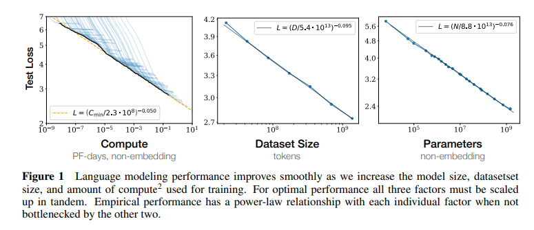
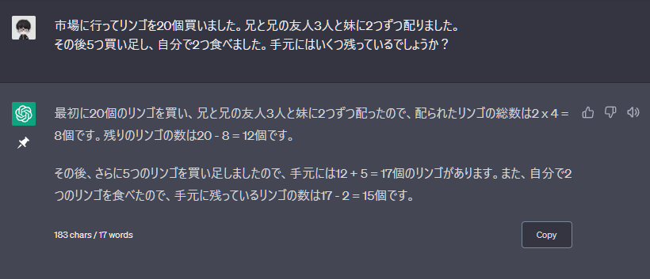
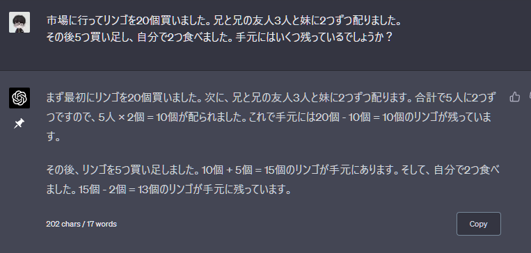
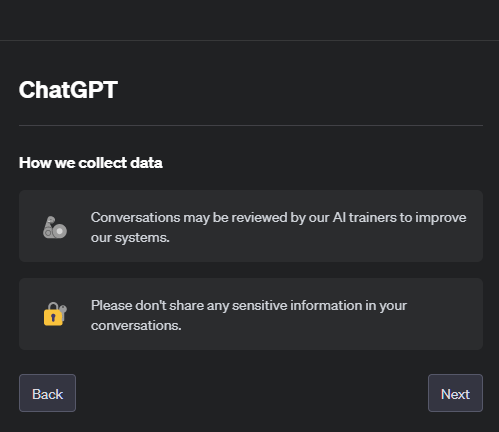

## この記事ではChatGPTに関する誤解を解きます

2022年末にChatGPTが一般向けにリリースされた時はエンジニア界隈と機械学習界隈が盛り上がるだけでしたが、GPT4をベースにしたChatGPTがリリースされた2023年3月以降はテレビや新聞でも大々的に取り上げられるようになり、世界中の人たちが汎用AIに注目するようになりましたね。そもそも機械学習の原理に明るくない人からすると突然人間に取って代わるようなAIが登場したので、ターミネーターのスカイネット・マトリックスの機械世界のような未来がすぐそばまで来ているのではないか？といった漠然とした恐怖が広がっている節があるように思います。

また、ChatGPTはよく分からんけど凄い！という文脈でもChatGPTを過大評価しているようなケースも多く見受けられます。特に、以前述べたHallucination[^1]の危険性を知らずに「この利用法はスゲーだろ！」と声高らかにTwitterでシェアしている方がちらほら見受けられることに危険性を感じます。さらに怖いのは、かつてのWeb3信者のような盲信的サポーターがこうしたデマを無条件に信じてしまっていることです。

Twitterの世直しは私には荷が重すぎるので、少なくとも私の周囲の方々がChatGPTを上手に扱うお手伝いができれば良いな、と思ってこの記事を作成しています。

[^1]: ChatGPTがでまかせを述べてしまう現象のこと。既知の問題としてOpenAIも認識しています。

### この記事を読むとこんなことが分かる

この記事では以下の内容を深掘りしていこうと思います。

- ChatGPTとGPT、、、って何？
- GPTは"思考"をしない、ただの確率モデルである
- ChatGPTは事実ではないことを、さも事実かのように述べる
- ChatGPTは2021年以降の事を知らない
- ChatGPTは計算ができない
- 個人情報は入力しちゃ絶対だめ！
- ChatGPTが得意なことは作文とプログラミング
- GPTは近い将来あらゆるアプリに組み込まれる
- 生物系研究者はAIをどう活用すべきか


この記事の執筆者は深層学習やLLMの研究の専門家ではなく、機械学習やゲノム解析を専門とする生物情報学の研究者です。
GPTに関して間違った説明をしていたら教えていただけますと幸いです。


## ChatGPTとGPT、、、って何？

ChatGPTはGPTという言語モデルを使ったサービスの名前です。GPTとは、Generalized Pretrained Transformerの略で、Transformerという言語モデルをベースに汎用AIとして深層学習させた言語モデルの一種です。

いきなり難しい言葉が沢山でてきましたね。まずは深層学習から始めて、一つずつ説明していきます。

### 深層学習とは

深層学習とは、ニューラルネットワークを祖とする機械学習モデルの一種です。機械学習と聞くと難しそうな雰囲気がしますが、最小自乗法の線形回帰だって機械学習です。要は数式を枠組みとして用意しておいて、データをうまく説明出来るように係数を推定しているのです。ニューラルネットワーク以前は本当にシンプルな数式ですべての自然現象を説明しようと頑張っていました。多項式回帰や重回帰、ランダムフォレストなどがこの分野に該当します。

ニューラルネットワークは文字通り生物の神経組織を模したもので、これまた機械学習の一種です。複数のニューロンが複数のニューロンから情報を受け取り、時にはその情報信号を増強したり抑制したりしながらこねくり回しつつ、最後にはシンプルな結果を出力するというものです。データをうまく説明できるように学習させる際には、この情報の増強/抑制の程度を推定します。深層学習はニューラルネットワークの層を増やして、深くしたものと考えておけば良いと思います。画像処理や言語処理など様々な分野において、深層学習はものの数年でそれまでの研究史を塗り替えるような高い精度の予測モデルを実現してきたため、2010年代後半のAIブームを支えてきました。

もう一度ChatGPTに話を戻すと、ChatGPTはこの深層学習がベースになっています。機械学習を通じて、文字列情報を入力として受け取り、情報を多層のニューラルネットワークに通して、なんらかの文字列情報を出力する確率モデルを作り出しています。機械学習によって作り出された確率モデルがGPT-3.5やGPT-4です。

確率モデルの話はこの後の「GPTは"思考"をしない、ただの確率モデルである」にて説明します。

### GPTはどういう経緯で生まれたか

ニューラルネットワークの発想はアラン・チューリングが"On Computable Numbers"(1937)で既に述べており、ジョンフォンノイマンらがその応用方法などについても示していましたが、今ほどは流行っていませんでした。その理由は単純で、当時の機械学習モデルは精度が良くなかったのです。

今のAIブームは[2012年に発表されたジェフェリー・ヒントンらの論文](https://dl.acm.org/doi/10.1145/3065386)がきっかけになっています。この論文はImageNet Large Scale Visual Recognition Challengeというコンペで彼らが優勝したときの手法を述べたもので、深層学習を使っていました。ポイントは畳み込み層というものを用意したことや、情報の増幅/抑制にReLU関数というものを導入したことでした。また、膨大な計算をGPUで高速に処理できるよう実装したことも現代的な深層学習にも通ずるポイントです。実のところジェフェリー・ヒントンらのモデルの精度を上回るものが翌年には出てきたため、つかの間のベスト精度だったわけですが、畳み込みニューラルネットワークをベースとして、活性化関数にReLU関数に採用するだけで、様々な画像認識タスクでいとも簡単に良い精度のモデルが作れるようになりました。ここから爆発的にAIブームが始まったと言われています。この時代はCNN(Convolutional Neural Network)の時代だと言われます。

CNNは言語モデルにおいてはあまり役に立たないのですが、短期的な記憶能力を実装したRNN(Recurrent Neural Network)を使うことで自然言語タスクでも深層学習が活躍するようになります。しかし、RNNを使った言語モデルは長文に対応できないなどの致命的な欠点がありました。ブレイクスルーは[2014年のAttention機構](https://arxiv.org/abs/1409.0473)とXX年のTransformerモデルの発表です。Attension機構は人間の認知科学を参考にしたもので、重要な部分のパラメーターを重くすることでデータの一部分に注目し、データ全体を的確に捉えようとするものです。XX年にGoogleから発表されたTransformerモデルは現在のGPT、GoogleのBardなど、昨今の全ての言語モデルの礎となった極めて重要なモデルです。Transformerモデルを発表した論文のタイトルはズバリ["Attention Is All You Need"](https://arxiv.org/abs/1706.03762)。RNN層などは使わず、当時はサポーティブな技術だったAttetion機構をメインに採用した、画期的なモデルでした。

Transformerは翻訳タスクにおいて非常に良い性能を発揮しました。どれくらい良い性能だったかと言うと、未知単語は無いという条件のもとでは数十年かけて構築されてきた過去の言語モデルに匹敵する精度だったのです。Transformerモデルはこれまでの言語モデルの欠点を解決したモデルです。このモデルをベースに、Google、Meta、OpenAIなどが独自の学習データを用意し、独自のモデルを作るようになっていきます。

Meta(旧Facebook)が作ったのはBERT(2018)という機械学習手法で、しばらくの間はBERTがこの業界のメインストリームでした。この頃、私の知人がBERTを使ったSNSのデータ分析をやりたがっていたのを覚えています。OpenAIはその間にMicrosoftの出資を受けながら現在のGPTを開発していました。その成果が今になって結実したということになります。


当時のAI開発は基本的にオープンソース(内部のプログラム等を全て公開する)で進められており、GAFAがバチバチと競争するような状況ではありませんでした。そのため、Transformerモデルのような画期的な発明でもプレプリントにサクッと公開してしまっていました。個人的には「協力して集合知で最強のAIを作ろうぜ！」という当時の雰囲気は結構好きでしたが、ChatGPT以降はクローズドソースも増えてきてしまいました。。


### 巨大テック企業のAI軍拡競争はなぜ起きたか

元はといえばTransformerモデルはGoogleがオープンソースで発表したもの。しかし2023年現在ではOpenAIとMicrosoftがChatGPTで世界中の注目を集め、BaiduやGoogleがそれに追従する形になっています。なぜ他の企業が参入できないのでしょうか？

その理由はTransformerが持つ重要な性質である、"Scaling-law"にあると思います。

Scaling-lawはOpenAIが発見し、[2020年に報告しました](https://arxiv.org/abs/2001.08361)。Scaling-lawを一言で説明するなら、「金をかければかけるほど、データを増やせば増やすほど、Transformerモデルの性能は青天井に向上する」ということです。

通常こんなことは考えにくいのです。なぜなら、どんな機械学習だって普通は過学習(over-fitting)が起き、どこかで性能の限界が来るからです。過学習とは、簡単に言えば学習データに最適化しすぎて未知の問題をうまく答えられなくなる現象のことです。小テストばっかり勉強しすぎて本番のテストにうまく答えられない、みたいな感じです。この過学習はいかなる機械学習でも起きうるので、通常は学習データを増やしすぎると性能がかえって低下するものです。

もちろんいつかTransformerの限界は来るのかもしれませんが、少なくともまだ限界は見えていません。この重要な性質があるため、私たちのような持たぬ者は彼らに対抗できないのです。GAFAが巨額の資金を投入して作ったモデルに我々が勝てる見込みは無く、しかもお金をかければかけるほど性能が上がるわけです。

ちなみに、GAFAがどうやって機械学習を行っているかですが、[Googleは深層学習専用のプロセッサであるTPUを開発](https://cloud.google.com/tpu?hl=ja)し、独自に大量の計算機を用意してBardを作りました。Metaは[Amazonと提携](https://appmaster.io/ja/news/meta-aws-patonashitsupu-ai-risachi-pytorch-sapoto)し、AWSを使って研究を行っているものと推定されます。OpenAIは言わずもがな、MicrosoftのAzureが使えるでしょう。

### ここまでのまとめ

専門用語がたくさん出てきたので理解が難しかったかもしれませんが、一度GPTについてまとめておきます。

まず、GPTとは、Googleが発明したTransformerというモデルをベースに、OpenAIが開発した深層学習モデルのことでした。

Transformerは言語処理に適した、画期的なモデルです。"Scaling-law"という特徴により、Transformerモデルはお金をかければかけるほど性能が向上し、2023年現在も「より大量のデータで、より性能の高いモデル」を作るべくGAFA(+α)が鎬を削っている状況です。

## GPTは"思考"をしない、ただの確率モデルである

ChatGPTを使っていると、あまりにもこちらの命令を的確に理解している(ように見える)ので、「GPTは賢い」とか「AIはなんでもできる」と思えますよね。しかし、GPTをはじめとする言語モデルはただ確率の高い文字を並べているだけなので、思考などはしていません。魂も脳も無い、ただの確率モデルに過ぎません。

これはGPTがどのように作られたかを知ると分かりやすいかもしれません。

### GPTの学習方法

ここまでの説明で、GPTが大量の文字列データを学習している事がお分かりかと思いますが、では学習とは具体的に何をしているのでしょうか？

それは、虫食い問題をひたすら覚えているのです。「イギリスの首都は□□である。」が問い、正解データは「ロンドン」と言ったように、虫食いの文章を大量に覚えているのです。ベースとなる文章には世界中のWebサイトからクロール[^2]してきた文章で、おそらく大量のデータを使用しています。GPTはクローズドソースのため、詳細は明らかにされていません。

[^2]: スクレイピング等の技術を使ってプログラムによりデータを自動収集する手法のこと。クロール禁止の規定を用意しているサイトも多いが、人間がウェブアクセスしたかのように見せる方法もあるので防ぎようが無い。

### 確率的言語モデル

結果として完成したモデルは、以下のように「我輩」に続く言葉を一つずつ確率的に導いています。ある種のメタファーで「GPTは夏目漱石を知っている」と捉えることもできますが、実際には最も確率の高い言葉を並べているだけです。

ChatGPTでは文末に「英語から日本語に翻訳してください」と付ければ英語を日本語へ翻訳することが可能ですが、確率的に日本語が続きやすいという性質が反映されているだけなのです。



このように考えると、ChatGPTに関する多くの漠然とした不安は解消されるのではないでしょうか。ChatGPTは何も思考していません。ただ確率的に単語を並べて見せているだけです。ChatGPTは人間を支配しようとはしていません。ChatGPTに意思などそもそも無い(はず)なのですから。

## ChatGPTは事実ではないことを、さも事実かのように述べる

### Hallucinationとは

AIが事実に即していない情報を自信満々に語る現象のことをHallucinationと呼びます。([Wikipedia: 幻覚(人工知能)](https://ja.wikipedia.org/wiki/%E5%B9%BB%E8%A6%9A_(%E4%BA%BA%E5%B7%A5%E7%9F%A5%E8%83%BD)))

特にChatGPTのGPT-3.5(2022年末に公開され、現在フリー版として公開されているモデル)ではしばしばHallucinationが観察されており、人々はこれを「嘘つきだ」と言っています。

これは結構難しい問題で、OpenAIはもちろん、各社がHallucinationが起きないような入力方法を検討したり、そもそもHallucinationしないようにファインチューニングした新しいモデルを作成しています。ちなみに、GPT-4はGPT-3.5よりもHallucinationが起きにくくなっているそうで、私も使っている限りかなり改善しているように思います。







### Hallucination対策はどうしたらよいか？

後述の別サービスを使うことが第一です。PerplexityやBingは出典情報を添付するため、ChatGPTよりはHallucinationが起きにくくなっています。

第二に、適切なプロンプティングをすることです。プロンプティングとは、GhatGPTへの入力のことです。ChatGPTは「～～してください」という指令だけでプログラミング・作文・メール作成などあらゆるタスクをこなすことが出来るため、ChatGPTへの入力方法が様々検討されています。プロンプティングについては[記事を作成しています]()ので、詳しくはそちらをご覧ください。



## ChatGPTは2021年以降の事を知らない

そもそもGhatGPT-3.5は2019年まで、GPT-4は2021年までの情報を使って機械学習が行われています。2022年以降に現実世界で起きたことは何一つ知らないのです。

一見それっぽいこと(例えば、論文を紹介してくるなど)を返答してくることがあっても、ファクトチェックをすれば今年の出来事は全てHallucinationで満たされているはずです。

### 最新情報はChatGPTに聞いてはならない

以上の理由から、2021年以降の事はChatGPTに聞いたところで、嘘の情報が返ってくる可能性大です。この現象はどうしようもないので、後述の別サービスを使う方が良いでしょう。

### BardもたまにHallucinationする

Bardは検索エンジンを

## ChatGPTは計算ができない

やってみれば分かりますが、ChatGPTは計算が苦手です。以下の文章題では明らかに13個が正解なのですが、堂々と計算式まで出しておきながら間違えています。

これもHallucinationと同じくOpenAIが以前から認識していた問題で、GPT4では改善しているそうです。

以前紹介したプロンプティングの[few shotsなどを使えば改善する](https://qiita.com/kujirahand/items/aed18c8298bb9bd41934)ことはよく知られていて、様々なプロンプティング解説サイトに書いてあります。とはいえ･･･計算問題はあまりChatGPTに任せない方が良いと考えた方が良いのではないでしょうか。

最近見た話では、pythonプログラムとして目的の計算を実装させれば複雑な計算も可能だと聞きました。



## 個人情報は入力しちゃ絶対だめ！

これは非常に重要な注意事項なのですが、ChatGPTで行われた会話はOpenAIの学習データに転用される可能性があります。実際に[Amazonで入力された機密情報がChatGPTの出力から出てきてしまった](https://www.businessinsider.jp/post-264782)こともあったらしく、要注意です。

GPT-3.5、GPT-4のAPI版[^3]であればデータを学習データに使われることはありません。また、つい[先日ヒストリーを記録できない代わりに学習データには使わないモードが実装されました](https://www.itmedia.co.jp/news/articles/2304/26/news075.html)

[^3]: プログラムからWebサービスを実行するための仕組みです。ChatGPTのようなWebアプリとしてのUIがありませんが、自作のアプリなどにGPTを組み込むなどの応用が可能になります。APIは従量課金制ですが、随分安い利用料設定になっていることも一時話題になっていました。

## ChatGPTが得意なことは作文とプログラミング

計算が苦手なら何が得意か？個人的に私が安全に活用できると思っているのは作文とプログラミングです。

たとえば、会社のお偉いさんに送るメールは失礼のないよう、数十分時間をかけて書いていた時期が私にもありました(しかもそれを上司が添削したりする)が、そういったことはChatGPTにやらせた方が良いです。また、倫理的にどうかは別として、読書感想文を作らせることも得意だと思います。いずれにせよ、何かしらのテーマで作文をさせる分にはChatGPTは余計なこともしないし、良い文章を作ってくれるはずです。論文を書くのにも役立つかもしれませんね。

ChatGPTはプログラミングもかなり得意です。たとえば、ChatGPTでは「matplotlibを使って棒グラフを作りたい」とか「argparseを使ってコマンドライン引数をとるプログラムを作りたい」といったように、使い慣れないフレームワークに関してミニマムなコードをサクッと作成することができます。仮にエラーが出ても、エラー文ごとコピペ、修正を要求すれば正しいコードになって返ってきます。Step by Stepでコードを修正していけば、複雑な操作もちゃんとしたコードに落とし込んでくれるでしょう。

ただ、たまにどうやっても動作しないようなコードを書いてくることもあります。pandasとpolarsを使い分けたりなど、新しめのフレームワークに関する細かい情報は当然知らないので、でたらめのコードでっち上げてくることがあります。プログラミングの場合は動作確認をしないわけがないので、すぐにファクトチェックされますけどね。

## GPTは近い将来あらゆるアプリに組み込まれる

前述のAPIが既に公開されているため、非常に多くのサービスがChatGPTを使ったサービスを展開しています。Powered by GPTで検索するとどんなサービスがあるか見つけられるでしょうが、サイトを読み込ませたらそのサイトについて教えてくれるチャットボットを作成するSiteGPTや、デザイン込みでレジュメを自動作成してくれるkickresumeなどがあります。

APIに加えて、GPT-4を他のサービスとボタン一つで連携可能な[Plugin機能も公開予定であると発表されています](https://openai.com/blog/chatgpt-plugins)。現状APIをうまく活用できるエンジニアだけが創意工夫で自由にサービスをローンチできる状況ですが、今後はAIを誰もが活用する時代が来るのでは無いかと考えられています。技術的な障壁はどんどん無くなっていくでしょう。

## 生物系研究者はAIをどう活用すべきか

では最後に、生物系研究者がChatGPTを始めとするサービスを研究にどう活かしたら良いか、解説したいと思います。

### とにもかくにもGPT-3.5ではなくGPT-4を使いましょう

GPT-3.5とGPT-4の差はかなり大きいです。通常GPT-4は月に$20も払わないといけないと使えないのですが、「それくらいなら安い」と思ったなら迷わず課金してください。$20で高校生くらいの頭脳を持ったAIが雇えるなら安いものだと私は考えています。

別の方法としては、Edgeブラウザーに搭載されているBingを使う方法が挙げられます。EdgeはMicrosoftが開発しているブラウザで、Chromeみたいなものです。MicrosoftはGoogleが持つ検索エンジンとブラウザのシェアを奪うため、GPT-4をBingとしてEdgeに搭載しました。この中身がGPT-4で動いているため、課金しなくてもGPT-4を使うことが出来ます。

EdgeのBingには以下のようなメリットがあります。

- GPT-4を無料で使える
- Bingは検索エンジンとインテグレートされているので、出典が必ず記載される
- ChatGPTに存在する文字数制限が無い(が、全ての入力が反映されていない気もする)
- Webページ要約機能がある(Summarize current web pageなどとプロンプティングする)

一方デメリットはUIが若干見づらかったり、履歴が保存できないことです。また、性能的にChatGPTと同等なのかは割と謎です。あまり検証されていません。

### 調べ物ならPerplexityを使いましょう

[Perplexity.ai](https://www.perplexity.ai/)はChatGPTとも異なるセクターのサービスで、GPT-4やBingが発表される前から出典を添付してくれるチャットボットサービスとして公開されていました。GPT-4とどっちが賢いのかはあまりよく分かりませんが、調べ物をする上では極めて有用です。この数ヶ月私はめちゃめちゃ使っています。つい最近スマホアプリ版もリリースされました。

また、この記事を書いているさなかにSerach-GPTなるサービスがOpenAIから発表されましたので、Perplexityに似たサービスがOpenAIからも出てくると思われます。

### ChatGPTはお役所仕事の時に使うのが良い

これは完全に私の個人的見解ですが、ChatGPTは手紙の書き出しや会社のお偉いさんへの形式張ったメール、科研費の申請など、表面上取り繕うことが重要なお役所的作文には適任だと思っています。シチュエーションや文面の内容、伝えてほしい細かいニュアンスなどを指示すれば、あなた好みで失礼の無い文面が簡単にできるはずです。

### ちょっとしたプログラミングには良い

ChatGPTなどのAIサービスはプログラミングが得意ですが、まだまだ大きいサービスを一からプログラミングすることはできません。いずれ出来るようになるかもしれませんが、結局プログラマーやエンジニアの仕事がAIに奪われることはおそらく無いと思います。

これからの時代は義務教育でプログラミングを学び、ちょっとしたプログラミングならすぐに実行できる人たちが社会に出てくるのだろうと思いますが、そういった方々はAIにミニマルなコードを書かせて業務効率化するような未来が最も現実的だと思います。少しだけPythonが書ける、C++が実行できる、といった環境構築だけしておけば、様々な場面でChatGPT製コードによる業務効率化が図れることでしょう。

### アイデアを想起する

GPT-4はただの確率的言語モデルには違いないのですが、このままいくと人間の思考力を凌駕すると可能性があると言われています。このまま学習データを大きくすれば確実に人間の思考力を超えるので、近い将来に起きることです。私はこれがある種神秘的な現象だと思っていて、「人間の神経細胞を模した計算機を用意して、虫食いの文章を覚えまくれば、内部の構造は理解できなくとも思考するロボットが完成する」ことを意味していると思います。つまり、哲学や善悪の判断、期待、愛情、、、人間の専売特許だと思われていた思考、魂とも呼称されるモノはTransformerモデルにより再現可能かもしれず、人類は脳科学の真理にたどり着いたのではないかと私は思うわけです。

ではそれを前提として、倫理的にどうこれを扱うかは今まさに欧州各国などの有識者に任せるとして、我々はメリットデメリットを把握した上でうまく使いこなすことが重要なのではないでしょうか。ここまでに提案してきたChatGPTの使い方は表面的なものでしたが、Transformerモデルが人間に近い思考力を見せているとするならば、自分には思いつかなかったアイデアをAIに求めることもできるのではないでしょうか？

現に、AIにより作成された絵画