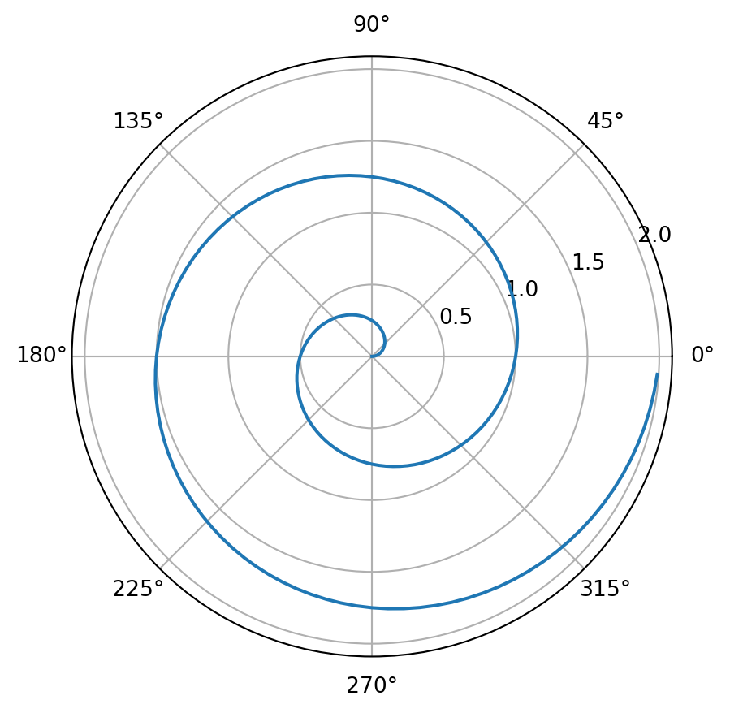

## Polar Axis

For a demonstration of a line plot on a polar axis, see [Figure 1](#fig-polar).

``` python
!pip install nbclient
import sys
print(sys.executable)
```

    Requirement already satisfied: nbclient in /home/oodake/.pyenv/versions/3.10.6/lib/python3.10/site-packages (0.6.8)
    Requirement already satisfied: nbformat>=5.0 in /home/oodake/.pyenv/versions/3.10.6/lib/python3.10/site-packages (from nbclient) (5.4.0)
    Requirement already satisfied: nest-asyncio in /home/oodake/.pyenv/versions/3.10.6/lib/python3.10/site-packages (from nbclient) (1.5.5)
    Requirement already satisfied: traitlets>=5.2.2 in /home/oodake/.pyenv/versions/3.10.6/lib/python3.10/site-packages (from nbclient) (5.3.0)
    Requirement already satisfied: jupyter-client>=6.1.5 in /home/oodake/.pyenv/versions/3.10.6/lib/python3.10/site-packages (from nbclient) (7.3.4)
    Requirement already satisfied: tornado>=6.0 in /home/oodake/.pyenv/versions/3.10.6/lib/python3.10/site-packages (from jupyter-client>=6.1.5->nbclient) (6.2)
    Requirement already satisfied: pyzmq>=23.0 in /home/oodake/.pyenv/versions/3.10.6/lib/python3.10/site-packages (from jupyter-client>=6.1.5->nbclient) (23.2.1)
    Requirement already satisfied: jupyter-core>=4.9.2 in /home/oodake/.pyenv/versions/3.10.6/lib/python3.10/site-packages (from jupyter-client>=6.1.5->nbclient) (4.11.1)
    Requirement already satisfied: entrypoints in /home/oodake/.pyenv/versions/3.10.6/lib/python3.10/site-packages (from jupyter-client>=6.1.5->nbclient) (0.4)
    Requirement already satisfied: python-dateutil>=2.8.2 in /home/oodake/.pyenv/versions/3.10.6/lib/python3.10/site-packages (from jupyter-client>=6.1.5->nbclient) (2.8.2)
    Requirement already satisfied: jsonschema>=2.6 in /home/oodake/.pyenv/versions/3.10.6/lib/python3.10/site-packages (from nbformat>=5.0->nbclient) (4.16.0)
    Requirement already satisfied: fastjsonschema in /home/oodake/.pyenv/versions/3.10.6/lib/python3.10/site-packages (from nbformat>=5.0->nbclient) (2.16.1)

    Requirement already satisfied: pyrsistent!=0.17.0,!=0.17.1,!=0.17.2,>=0.14.0 in /home/oodake/.pyenv/versions/3.10.6/lib/python3.10/site-packages (from jsonschema>=2.6->nbformat>=5.0->nbclient) (0.18.1)
    Requirement already satisfied: attrs>=17.4.0 in /home/oodake/.pyenv/versions/3.10.6/lib/python3.10/site-packages (from jsonschema>=2.6->nbformat>=5.0->nbclient) (22.1.0)
    Requirement already satisfied: six>=1.5 in /home/oodake/.pyenv/versions/3.10.6/lib/python3.10/site-packages (from python-dateutil>=2.8.2->jupyter-client>=6.1.5->nbclient) (1.16.0)

    /home/oodake/.pyenv/versions/3.10.6/bin/python3

``` python
import numpy as np
import matplotlib.pyplot as plt

r = np.arange(0, 2, 0.01)
theta = 2 * np.pi * r
fig, ax = plt.subplots(subplot_kw={'projection': 'polar'})
ax.plot(theta, r)
ax.set_rticks([0.5, 1, 1.5, 2])
ax.grid(True)
plt.show()
```

<figure>

<figcaption aria-hidden="true">Figure 1: A line plot on a polar axis</figcaption>
</figure>
